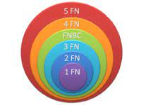
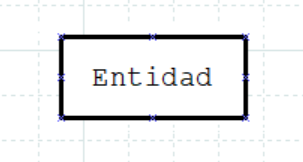
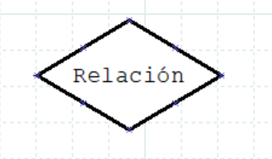
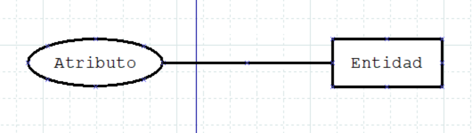
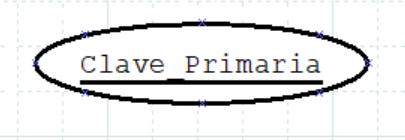
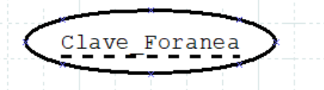
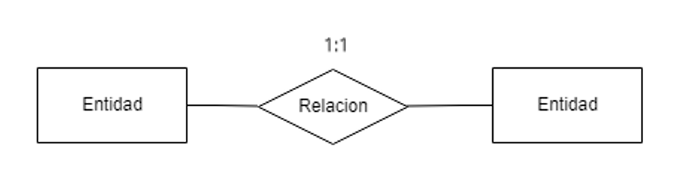
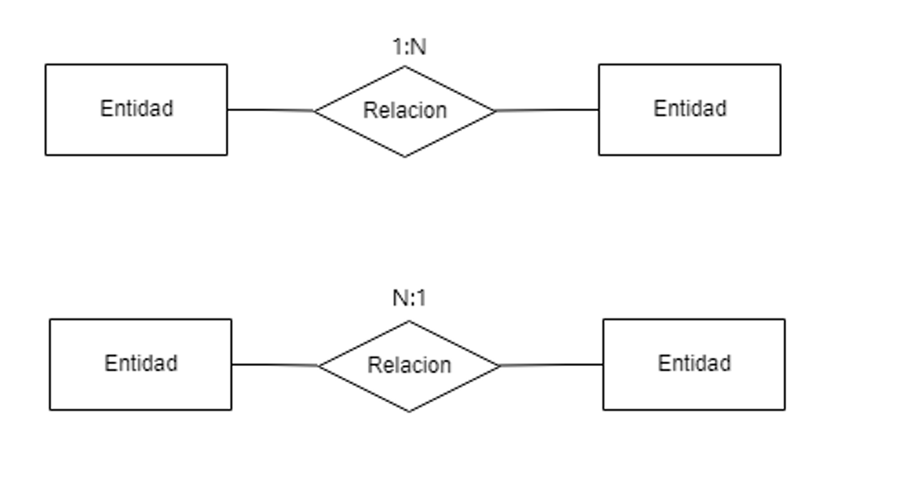
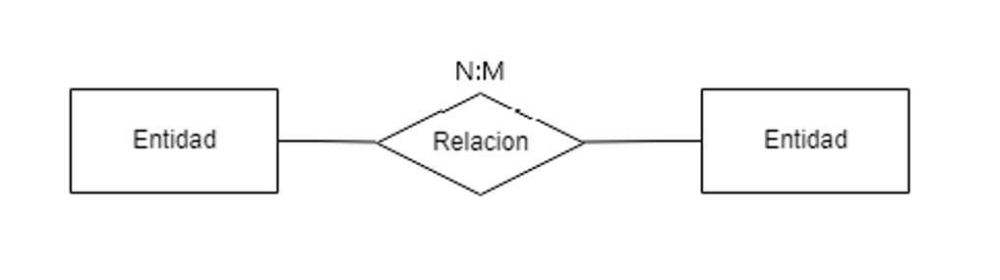

# [Bootcamp Web Developer Full Stack](https://www.thebridge.tech/bootcamps/bootcamp-fullstack-developer/)
### JS, ES6, Node.js, Frontend, Backend, Express, React, MERN, testing, DevOps

# BD Relacionales 1

## MySQL 

### MySQL: Instalación

**Instaladores:**
Debemos instalar MySQL Workbench y MySQL Server 

Enlaces:
- [Workbench](https://dev.mysql.com/downloads/workbench/)
- [Server](https://dev.mysql.com/downloads/windows/installer/8.0.html)

Se debe seguir el proceso de instalación de ambos

### MySQL: Workbench 
Herramienta visual que permite administración, gestión y mantenimiento de bases de datos MySQL. Se trata de un cliente como hemos dicho, con interfaz gráfica.

**Algunas características:** 

- Creación, conexión y gestión de instancia de base de datos.
- Soporte para complementos personalizados.
- Exploración de esquema de objetos.
- Resaltado de sintaxis en SQL y analizador de declaraciones.
- Iniciar y detener instancias de base de datos.
- Configuración de instancias.
- Administración de cuentas en base de datos.
- Exploración de instancias variables.
- Exploración de ficheros de registros.
- Exportación e importación masiva de datos.

### Conceptos importantes

A continuación vamos a hablar de algunos conceptos que son muy importantes en este tipo de Bases de datos, algunos de ellos ya los hemos comentado, pero vamos ahora vamos a definirlos mejor.

**Sistema Gestor de Bases de Datos (SGBD):** Sistema o aplicación que permite administrar y gestionar en general, bases de datos (Ejemplo: MySQL Workbench, aplicación que ya hemos instalado).

**Columa:** Dato individual que forma parte de un conjunto de datos relacionados conceptualmente entre sí (Ejemplo: DNI de un cliente)

**Fila o registro:** Conjunto de datos relacionados entre sí, pertenecientes a un sólo objeto de información dentro de la base de datos (Ejemplo: todos los datos de un cliente, “código de cliente, nombre, apellidos, DNI, edad...”). Las filas o registros están formadas por columnas (datos individuales).  

**Tabla:** Colección de filas que tienen una relación conceptual entre ellas (Ejemplo: clientes)

**Restricción:** Regla que se impone a los datos, para poder mantener la fiabilidad de la información dentro de la Base de Datos (Ejemplo: El código que identifica a cada cliente debe ser único, para poder localizar a un cliente sin lugar a dudas)

**Dominio:** Conjunto de valores que puede tomar un campo, concepto relacionado con el tipo de dato que se se le asigna al campo (Ejemplo: número entero).

**Integridad de la información:** Propiedad que busca mantener los datos libres de modificaciones no autorizadas.

**Integridad referencial:** Propiedad que busca poder referenciar información sin lugar a dudas, esta propiedad en una base de datos relacional, se apoya en las restricciones, para que no haya lugar a dudas acerca de que la información que se extrae es correcta.

**Redundancia de datos:** Repetición de datos en diferentes tablas. Esto se intenta evitar a toda cosa en las Bases de Datos Relacionales, dado que duplicar o triplicar datos implicaría mayor necesidad de espacio en disco y menor eficiencia en general.

**Normalización:** Proceso que consiste en aplicar una serie de reglas a las tablas para: 
- Evitar redundancia de datos.
- Disminuir problemas de acceso y actualización de datos en las tablas
- Proteger la integridad de la información.  

Existen 5 formas normales en las que puede estar una tabla (si decimos que una base de datos está en una forma normal es porque todas las tablas de la misma cumplen esa forma normal o reglas). No vamos a entrar en detalles, dada la complejidad del tema, pero si quieres profundizar en las administración de Bases de Datos es recomendable que amplíes información.

### Diseño de BD Relacionales: 
El diseño de Bases de datos relacionales es primordial para el correcto funcionamiento posterior de la Base de Datos. 

Como ya hemos mencionado anteriormente, lo más importante es la corrección, no redundancia e integridad de la información y para conseguir estas características es necesario hacer un buen diseño de la Base de datos. 

En el diseño pasamos por tres etapas: 

**1.	Diseño conceptual:** Esta etapa consiste en la realización del Diagrama Entidad-Relación del que vamos a hablar más adelante. En él damos forma a nuestra base de datos desde el punto de vista de la información a más alto nivel y la relación entre todos los bloques de información. Este diseño es completamente independiente del motor de Base de Datos usado, es decir, no es relevante saber si la vas a crear en MySQL o en otra tecnología.

**2.	Diseño lógico:** Bajamos un poco de nivel y vemos la Base de Datos en un diagrama UML que nos resalta con líneas los campos que están relacionados entre si, es decir los que son claves foráneas (conceptos de los que vamos a ir hablando poco a poco en el siguiente apartado). Aún esta etapa es independiente de MySQL.

**3.	Diseño físico:** Creación de script de Base de Datos, en nuestro caso en MySQL, que debe ser el reflejo de los dos diseños previos, la utilidad de los mismos es darnos la información para poder realizar el script que nos permita crear la Base de Datos con nuestras premisas.

## Diagramas E/R
Se trata de un diagrama que permite representar el diseñ de una BD Relacional.
En él podremos plasmar lo que serán futuras tablas y las restricciones que vamos a aplicar en los datos de las mismas.

### Dia: Instalador
Necesitamos un editor de diagramas ER

Enlace:
- [Dia](http://dia-installer.de/index.html.es)

### Entidades
Se trata de un conjunto de objetos con existencia independiente del resto de otros y con datos en comñun a nivel semántico. Si el conjunto sólo tiene un elemento no se considera entidad, es decir, la cantidad de elementos de la entidad debe ser > 1.

**Ejemplos:** 
- Clientes
- Proveedores
- Productos
- Autores
- Libros

**Ejemplo en el diagrama:**

### Relaciones 
Describe una interacción entre los datos de entidades. Lo normal es que haya relación entre dos o más entidades, aunque se puede dar el caso de que haya una relación reflexiva (una entidad que se relaciona consigo misma)

**Ejemplos:** 
- Dos entidades: Un cliente compra productos, siendo clientes y productos dos entidades.
- Reflexiva: Un tema está compuesto por temas, siendo temas una entidad.

**Ejemplo en el diagrama:**

### Atributos
Características que definen o identifican a una entidad.Se trata de los datos individuales que vamos a almacenar de cada registro, van a almacenar los datos individuales de los elementos de la entidad

**Ejemplos:**
- Para una entidad clientes: nombre, apellidos, dni, email...
- Para una entidad Libro: titulo, num_paginas, isbn

**Ejemplo en el diagrama:**

### Clave primaria
Una clave primaria, es un atributo que permite identificar de forma única a un elemento de una entidad para poder localizar dicho elemento sin confusión; se podría usar como clave primaria en una entidad de empleados, el DNI de cada empleado, aunque esto no es lo más recomendable como veremos, para localizar a cada uno sin lugar a dudas. Cabe resaltar que debe ser un dato único, que no tenga repetidos.  

**Ejemplo en el diagrama:**

### Clave Foránea
Se trata de un atributo de una entidad, que nos permitirá identificar de forma única a un elemento de otra entidad, ya que apunta a la clave primaria de otra entidad.

**Ejemplo:** 
Si queremos saber cuál es la contraseña de un usuario concreto, colocaremos en la entidad usuario un atributo que sea el id de la contraseña y así podemos buscar la contraseña concreta, que le pertenece a ese usuario.

**Ejemplo en el diagrama:**

### Cardinalidades
Se define como la cantidad de elementos de una entidad, que se relacionan con cada elemento de la otra entidad y viceversa, por tanto tenemos que hablar de cardinalidades de las relaciones. 

Se trata de uno de los conceptos más complicados de comprender, pero es uno de los más importantes, ya que nos indica restricciones muy importantes para la corrección e integridad de la información que vayamos a tratar, ya que indica los elementos a bajo nivel, usando como herramientas las claves foráneas ya mencionadas.

**Ejemplos:** 
- Un cliente tiene una tarjeta y cada tarjeta es de un único clientes, siendo clientes y tarjetas entidades.
- Un cliente puede compara varios productos, pero cada producto sólo lo puede comprar un cliente, siendo clientes y productos entidades.
- Un proveedor provee muchos productos y cada producto lo proveen varios proveedores, siendo productos y proveedores entidades.

### Tipos de cardinalidades: 
**Uno a uno (1:1):**
Un elemento perteneciente a la entidad A se relaciona con sólo un elemento de la entidad B y viceversa.

**Ejemplos:** 
- Un usuario tiene una contraseña y cada contraseña pertenece a un único usuario, siendo usuarios y contraseñas entidades.
- Un empleado tiene un currículum y cada currículum es de un único empleado, siendo empleados y currículums entidades.
- Un jefe de obra lo es de una única obra y cada obra sólo puede tener un jefe, siendo jefes y obras entidades.

**Ejemplo en el diagrama:**

**Uno a muchos o muchos a uno (1:N o N:1):**
Un elemento perteneciente a la entidad A se relaciona con varios elementos de la entidad B y cada elemento de la entidad B se relaciona con un sólo elemento de la entidad A.

**Ejemplos:** 
- Un obrero coloca varios ladrillos, pero cada ladrillo es colocado por un único obrero, siendo obreros y ladrillos entidades.
- Un jefe de obra autoriza la compra de varios materiales, pero cada material sólo ha autorizado su compra un jefe de obra, siendo jefes de obra y materiales entidades.

**Ejemplo en el diagrama:**
El orden de las entidades define el lugar en el que ponemos la N

**Muchos a muchos (N:M):**
Un elemento perteneciente a la entidad A se relaciona con varios elementos de la entidad B y cada elemento de la entidad B se relaciona varios de la entidad A.

**Ejemplos:** 
- En una obra se usan muchos tipos de materiales y cada tipo de material se usa en muchas obras, siendo obras y materiales entidades.
- En una piscina se colocan muchos tipos de productos y cada producto se usa en muchas piscinas, siendo piscinas y productos entidades.
- Un proveedor provee muchos productos y cada producto lo proveen varios proveedores, siendo proveedores y productos entidades.

**Ejemplo en el diagrama:**

### Cardinalidad en la BD:

Las relaciones de los tres tipos de cardinalidades se traducen en los diagramas y más adelante en la Base de Datos de la siguiente forma: 

**Relación con cardinalidad 1:1:** Se coloca una clave foránea en al menos una de las dos entidades que intervienen en la relación.

**Relación con cardinalidad 1:N o N:1:** Se coloca en la entidad que lo permite (la que tiene que referenciar sólo a un dato, no se puede colocar un número indeterminado de claves en una tabla) una clave foránea o se crea una tabla nueva en la Base de Datos, si la disposición de los datos lo requiere. En el caso de que necesitemos crear una tabla, la relación (el rombo en el diagrama), llevará atributos, veremos ejemplos.

**Relación con cardinalidad N:M:** Se crea una tabla en la Base de Datos, no hay opción de colocar claves foráneas en las entidades, dado que cada entidad se relaciona con un número indeterminado de elementos de la otra. En este caso la solución es crear sí o sí una tabla nueva, lo que quiere decir que la relación tendrá como mínimo dos claves foráneas una que referencia a cada entidad que relaciona, veremos ejemplos.

