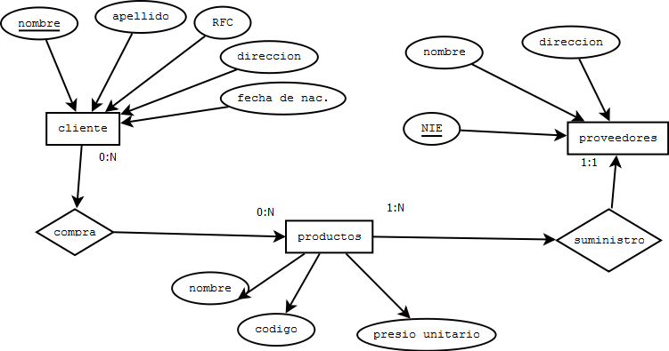
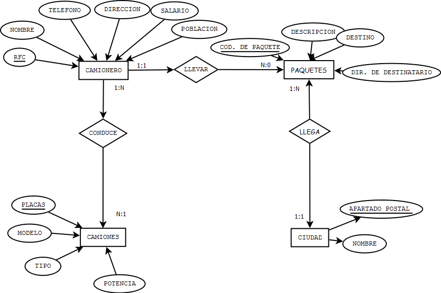

# [Bootcamp Web Developer Full Stack](https://www.thebridge.tech/bootcamps/bootcamp-fullstack-developer/)
### JS, ES6, Node.js, Frontend, Backend, Express, React, MERN, testing, DevOps

# BD Relacionales 3
## Ejercicios Resueltos
### 1: 
A partir del siguiente enunciado se desea realiza el modelo entidad-relación.
“Una empresa vende productos a varios clientes. Se necesita conocer los datos
personales de los clientes (nombre, apellidos, dni, dirección y fecha de nacimiento). Cada
producto tiene un nombre y un código, así como un precio unitario. Un cliente puede
comprar varios productos a la empresa, y un mismo producto puede ser comprado por
varios clientes.
Los productos son suministrados por diferentes proveedores. Se debe tener en cuenta
que un producto sólo puede ser suministrado por un proveedor, y que un proveedor puede
suministrar diferentes productos. De cada proveedor se desea conocer el NIF, nombre y
dirección”.

### 2:
A partir del siguiente enunciado se desea realizar el modelo entidad-relación.
“Se desea informatizar la gestión de una empresa de transportes que reparte paquetes
por toda España. Los encargados de llevar los paquetes son los camioneros, de los que
se quiere guardar el dni, nombre, teléfono, dirección, salario y población en la que vive.
De los paquetes transportados interesa conocer el código de paquete, descripción,
destinatario y dirección del destinatario. Un camionero distribuye muchos paquetes, y un
paquete sólo puede ser distribuido por un camionero.
De las provincias a las que llegan los paquetes interesa guardar el código de provincia y
el nombre. Un paquete sólo puede llegar a una provincia. Sin embargo, a una provincia
pueden llegar varios paquetes.
De los camiones que llevan los camioneros, interesa conocer la matrícula, modelo, tipo y
potencia. Un camionero puede conducir diferentes camiones en fechas diferentes, y un
camión puede ser conducido por varios camioneros”.

## Ejercicios
1. A partir del siguiente enunciado diseñar el modelo entidad-relación.
“Se desea diseñar la base de datos de un Instituto. En la base de datos se desea guardar
los datos de los profesores del Instituto (DNI, nombre, dirección y teléfono). Los
profesores imparten módulos, y cada módulo tiene un código y un nombre. Cada alumno
está matriculado en uno o varios módulos. De cada alumno se desea guardar el nº de
expediente, nombre, apellidos y fecha de nacimiento. Los profesores pueden impartir
varios módulos, pero un módulo sólo puede ser impartido por un profesor. Cada curso
tiene un grupo de alumnos, uno de los cuales es el delegado del grupo”.

2. A partir del siguiente supuesto diseñar el modelo entidad-relación:
“Se desea diseñar una base de datos para almacenar y gestionar la información
empleada por una empresa dedicada a la venta de automóviles, teniendo en cuenta los
siguientes aspectos:
La empresa dispone de una serie de coches para su venta. Se necesita conocer la
matrícula, marca y modelo, el color y el precio de venta de cada coche.
Los datos que interesa conocer de cada cliente son el NIF, nombre, dirección, ciudad y
número de teléfono: además, los clientes se diferencian por un código interno de la
empresa que se incrementa automáticamente cuando un cliente se da de alta en ella. Un
cliente puede comprar tantos coches como desee a la empresa. Un coche determinado
solo puede ser comprado por un único cliente.
El concesionario también se encarga de llevar a cabo las revisiones que se realizan a
cada coche. Cada revisión tiene asociado un código que se incrementa automáticamente
por cada revisión que se haga. De cada revisión se desea saber si se ha hecho cambio de
filtro, si se ha hecho cambio de aceite, si se ha hecho cambio de frenos u otros. Los
coches pueden pasar varias revisiones en el concesionario”.

3. Realiza el script de creación de la BD de los ejercicios resueltos

4. Realiza el script de creación de la BD del ejercicio 1

5. Realiza el script de creación de la BD del ejercicio 2