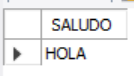

# [Bootcamp Web Developer Full Stack](https://www.thebridge.tech/bootcamps/bootcamp-fullstack-developer/)
### JS, ES6, Node.js, Frontend, Backend, Express, React, MERN, testing, DevOps

# BD Relacionales 5

## Pl-SQL en MySQL 
El Procedural Language/Structured Query Language (PL-SQL) es el lenguaje de programación que incorporan las Bases de Datos Relacionales, para realizar tareas automáticas, informes y una serie de trabajos desatendidos.

Añade lo siguiente a lo que hemos visto: 

- Todo de lo que dispone SQL 
- Manejo de variables
- Manejo de estructuras de control de flujo (como if, for…etc)
- Manejo de estructuras modulares (triggers, procedimientos y funciones)
- Manejo de excepciones (para el control de errores en ejecución)

Vamos a ver los conceptos que necesitamos para ser capaces de programar nuestros Triggers, Procedimientos y Funciones en MySQL.

## Conceptos previos
Vamos a ver todo lo que necesitamos conocer previamente para ser capaces de crear nuestros triggers, procedimientos y funciones en MySQL.

### Tipos de datos
Los tipos de datos que podemos usar en PL-SQL MySQL son los que podemos usar en la definición de campos para las tablas. 

Los tipos de datos en PL-SQL se utilizan para definir variables y constantes y éstas, como veremos a continuación, se usan para almacenar o representar datos de la Base de Datos, es por esto que no hay tipos de datos especiales para estos apartados.  

Repasa los tipos de datos que hemos visto en nuestra primera clase de BD Relacionales.

### Variables
Este es un concepto general de programación. Se usan para almacenar valores o resultados, pueden ser de cualquier tipo de datos y les podemos poner nombre.

A más bajo nivel, es un hueco en memoria volátil (RAM), que tiene un tamaño asociado a su tipo y que permite almacenar valores.

La sentencia MySQL que permite declarar variables es “DECLARE” y la que permite dar un valor inicial en la declaración es “DEFAULT”.

Se pueden inicializar o no.

Si queremos modificar su valor durante nuestos programas podemos usar las palabras reservadas "SET" o "INTO" 

**Sintaxis básica de la declaración:**
```
DECLARE nombreVariable tipo DEFAULT valor;
```
**Sintaxis básica de la modificación:**
```
SET nombreVariable = valor;

SELECT campo IN nombreVariable FROM...
```
**Ejemplos:**
```
DECLARE frase VARCHAR(200);

DECLARE nombre VARCHAR(100) DEFAULT “María”;

DECLARE numero INT DEFAULT 0;

DECLARE x,y INT;

DECLARE a,b INT DEFAULT 3;

DECLARE x INT;
SET x = 10;

DECLARE n VARCHAR(100);
SELECT nombre INTO n FROM Pacientes WHERE id = 3; #Siendo el campo nombre de Pacientes un VARCHAR(100)
```
Lo que hemos visto hasta ahora es para declarar y asignar valores a una variable dentro de un trigger, procedimiento o función, pero si quisiéramos hacerlo en nuestra consola de Workbench, se haría directamente con “SET”, es importante que el nombre de la variable empiece, en este caso con el carácter “@”, para distinguirla del resto de variables del SGBD y que usemos “DELIMITER”, sentencia que veremos más adelante.

**Ejemplo:**
```
DELIMITER //
SET @HOLA = "HOLA";

SELECT @HOLA;
```

El “SELECT” se usa para consultar el contenido de la variable y el resultado que nos muestra es el siguiente: 


```
DELIMITER //
SET @HOLA = "HOLA";

SELECT @HOLA AS SALUDO;
```


### Constantes
Se trata del mismo concepto de variable, pero la idea es que el valor que contiene no lo cambias durante todo el tiempo que dura la ejecución de tu programa.

En MySQL no hay una sentencia específica para constantes, se puede usar el valor directamente (Ejemplo: “Hola” o 3) o una variable y no cambiar su valor durante todo el programa.Se trata del mismo concepto de variable, pero la idea es que el valor que contiene no lo cambias durante todo el tiempo que dura la ejecución de tu programa.

### Estructuras de control de flujo
Si escribimos un bloque de código o programa (en el caso de MySQL son los triggers, procedimientos y funciones), se ejecuta de arriba abajo, línea a línea; se dice que la ejecución es secuencial.

Hay sentencias de PL-SQL que nos permiten que no se ejecute el código de forma lineal, secuencial, es decir, que nos permite ejecutar partes del código según condiciones o repetir líneas si lo necesitamos.

Veamos las herramientas que nos proporciona MySQL a este respecto.

### Condición simple (IF)
La utilidad de este bloque de código es permitir que si se cumple una condición se ejecute una línea de código y si no, no.

La lectura en lenguaje natural sería como puedes ver en algunos ejemplos: 

- Si hay un valor en un campo lo borramos
- Si una variable vale 3 insertamos un registro en una tabla

Es importante remarcar que podemos, de forma opcional, especificar el código que queremos que se ejecute si no se cumple la condición (ELSE).

Siempre se pulsa un tabulador para empezar a escribir el código que hay dentro de un bloque, esto es una norma de estilo que debes aplicar siempre, por legibilidad del código. Intenta seguir la sintaxis siempre.

**Sintaxis del if PL-SQL MySQL:**
```
IF condicion/condiciones THEN 
    codigo
[ELSEIF condicion/condiciones THEN 
    codigo
]… 
[ELSE 
    codigo
]
END IF;
```

- Tanto los “ELSEIF”, como el “ELSE” son opcionales

**Ejemplos:**
```
DECLARE s VARCHAR(20);

IF n > m THEN 
	SET s = '>';
ELSEIF n = m THEN 
	SET s = '=';
ELSE 
	SET s = '<';
END IF;

SET s = CONCAT(n, ' ', s, ' ', m);
```

- El resultado que puede dar esto es: 

1. Si n> m => s = “n>m”
2. Si n= m => s = “n=m”
3. Si no => s = “n<m” 		 

**Ejemplo: Veamos otra versión del mismo ejemplo:**
```
DECLARE s VARCHAR(20);

IF n > m THEN 
	SET s = '>';
ELSE
    IF n = m THEN 
        SET s = '=';
    ELSE 
        SET s = '<';
    END IF;
END IF;

SET s = CONCAT(n, ' ', s, ' ', m);
```

### Condicional Múltiple (CASE)
En el caso de que queramos comparar la misma variable o columna con diferentes valores, la estructura de control apropiada es “CASE”.

**Sintaxis básica:**
```
CASE variable/campo

    WHEN valorComparar1 THEN 
        codigo
    [WHEN valorCompararN THEN 
        codigo
    ] 
    ...
    [ELSE 
        codigo
    ]

END CASE;
```
Puede haber más de un “WHEN” con más de un valor a comparar (de hecho es la idea) y el “ELSE” (que será lo que se ejecute si la variable o campo no vale ninguno de los valores a comparar de ninguno de los “WHEN”) es opcional.

**Ejemplo:** 
```
DECLARE s VARCHAR(20);

CASE n

WHEN 1 THEN 
	SET s = 1;
WHEN 2 THEN 
	SET s = 2;
WHEN 3 THEN 
	SET s = 3;
WHEN 4 THEN 
	SET s = 4;
ELSE 
	SET s = 5;

END CASE;

```
- Si n vale de 1 a 4, s toma su valor, en cualquier otro caso s vale 5.

**Sintaxis alternativa básica:**
```
CASE
    WHEN condición/condiciones THEN 
        codigo
    [WHEN condición/condiciones THEN 
        codigo
    ]
    ...
    [ELSE 
        codigo
    ]

END CASE;
```
Puede haber más de un “WHEN” con más de una condición (de hecho es la idea) y el “ELSE” (que será lo que se ejecute si no se cumple ninguna condición) es opcional.


**Ejemplo:**
```
DECLARE s VARCHAR(20);

CASE
    WHEN n>1 THEN 
        SET s = 1;
    WHEN n>2 THEN 
        SET s = 2;
    WHEN n>3 THEN 
        SET s = 3;
    WHEN n>4 THEN 
        SET s = 4;
    ELSE 
        SET s = 5;

END CASE;
```
- Si n vale de 1 a 4, s toma su valor, en cualquier otro caso s vale 5.

## Bucles
### Loop

Permite repetir código y salir cuando lo estimemos oportuno

**Sintaxis básica:** 
```
    [etiqueta:] LOOP
        codigo
    END LOOP [etiqueta];
```

Es importante resaltar que el código puede ser cualquier sentencia permitida (declaración y uso de variables, select, if, case…etc)

**Ejemplo:**
```
    DECLARE p INT DEFAULT 3;
    label1: LOOP
        SET p = p + 1;	
        IF p < 10 THEN
            ITERATE label1;
        END IF;
        LEAVE label1;
    END LOOP label1;
```

Este bucle suma de 1 en un 1 el valor de p, que parte de 3, hasta llegar a 10 y para.
	
“ITERATE” implica que vuelva a “label1” y “LEAVE” para el bucle cuando ya no se cumple la condición.

Si el valor de p hubiera sido inicialmente mayor o igual que 10, el bucle no se hubiera ejecutado nunca. 

Se trata de un bucle genérico, en el que para parar hay que poner condiciones o usar “ITERATE” o “LEAVE”.


### Repeat
Esta estructura también es de repetición, pero en su propia estructura hay espacio para la/s condición/es de parada.

La particularidad que tiene es que primero se ejecuta el código y luego se comprueba la condición.

**Sintaxis básica:**
```
    REPEAT
        codigo
    UNTIL condicion/condiciones
    END REPEAT 
```
**Ejemplo:**
```
    DECLARE p INT DEFAULT 3;	
    DECLARE x INT DEFAULT 0;
    REPEAT
        SET x = x + 1;
    UNTIL x < p 
    END REPEAT;
```
En este caso el incremento de x en 1, se repite mientras x sea menor que p. Es decir, este bucle se repite 2 veces.

### While
Ésta es la última de las estructuras de control de flujo y de repetición que vamos a ver. También tiene espacio en su estructura para las condiciones.

En este caso, la condición se comprueba primero y luego se ejecuta el código.

**Sintaxis básica:**
```
    WHILE condición/condiciones DO
        codigo
    END WHILE
```
**Ejemplo:**
```
    DECLARE p INT DEFAULT 3;	
    DECLARE x INT DEFAULT 0;
    WHILE x < p DO
        SET x = x + 1;
    END WHILE
```
La condición se comprueba 3 veces y la ejecución es la misma que en el ejemplo del “REPEAT”

## Delimitadores
En MySQL el carácter delimitador de las instrucciones que hemos usado hasta ahora es “;”. Este carácter permite que dentro de un script MySQL con muchas instrucciones el intérprete del SGBD sepa dónde termina cada instrucción y pueda ejecutarlas en orden.

Cuando creamos bloques de código, como los que hemos visto (“IF”, “CASE”, “LOOP”, “REPEAT” y “WHILE”) no todas las líneas terminan en “;” y hay que redefinir el delimitador para evitar errores.

Esto es algo diferente en MySQL, con respecto a otros SGBD.

La sentencia MySQL para definir nuevos delimitadores es “DELIMITER” y lo que nos permite es definir delimitadores para saber el final de bloques de código.

**Sintaxis básica:**
```
    DELIMITER carácter/caracteres
```
**Ejemplo:**
```
    DELIMITER //
```

## Bloques de código
Cuando hablamos de bloques PL-SQL en MySQL, nos referimos a agrupar líneas de código con una funcionalidad específica.

Hay varios tipos de bloques: 

- Anónimos: Se construyen de forma dinámica y se ejecutan una sola vez.
- Subprogramas: Procedimientos y funciones, se ejecutan bajo demanda.
- Triggers: Se ejecutan respondiendo a un evento de la Base de Datos.

## Bloques anónimos 
Se trata de una serie de líneas de código que podemos ejecutar en conjunto.

**Sintaxis básica:**
```
    DELIMITER carácter/caracteres
    codigo
    carácter/caracteres
    DELIMITER ;
```
**Ejemplo: **
```
    DELIMITER //
    SET @saludo = "Hola";
    SET @numero = 0;
    SELECT @saludo;	
    SELECT @numero;
    //
    DELIMITER ;		
```	
**Resultado:**


