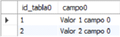
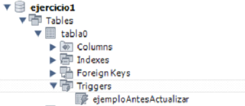
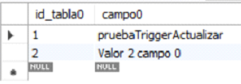
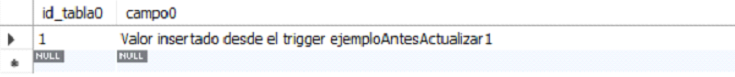

# [Bootcamp Web Developer Full Stack](https://www.thebridge.tech/bootcamps/bootcamp-fullstack-developer/)
### JS, ES6, Node.js, Frontend, Backend, Express, React, MERN, testing, DevOps

# BD Relacionales 6
## Triggers
Un trigger o disparador es un bloque de código que responde de forma automática y desatendida. 

**Tipos de triggers:**

- **DDL:** Asociados a todos los eventos de creación, modificación y borrado de Bases de Datos, tablas, usurios…etc. Es decir, asociados a todos los eventos relacionados con estructura de Bases de Datos, tablas, usuarios (“CREATE”, “ALTER” y “DROP”)…etc.
- **DML:** Asociados a todos los eventos relacionado con los datos, inserción, modificación y borrado (“INSERT”, “UPDATE” y “DELETE”).

En MySQL sólo podemos definir triggers DML, vamos a verlos con más detenimiento en los próximos apartados.

### Conceptos

La utilidad de estos bloques de código es realizar de forma desatendida labores de mantenimiento de la Base de Datos, de las tablas y de los datos.

Opciones: 

- Antes y después de la inserción (BEFORE/AFTER INSERT).
- Antes y después de la actualización (BEFORE/AFTER UPDATE).
- Antes y después del borrado (BEFORE/AFTER DELETE).

Por otro lado, este tipo de triggers se apoyan en dos tablas virtuales “NEW” y “OLD”, cuestión que funciona así en MySQL en concreto.

- En las inserciones “NEW” almacena lo que se va a insertar o ya hemos insertado.

**Ejemplo:**
Si dispongo de esta tabla: 
```
CREATE TABLE tabla0(
    id_tabla0 INT, 
    campo0 VARCHAR(100), 
    PRIMARY KEY(id_tabla0)
);
```
Y se ejecuta este “INSERT”:
```
INSERT INTO tabla0 
VALUES(null, “Esto es un ejemplo para la tabla NEW”);	
```
La tabla NEW contendrá: 
- Dos campos con nombres: “id_tabla0” y “campo0”.
- En “id_tabla0” si es la primera inserción habrá un 1 (NEW.id_tabla0 = 1)
- “campo0” contendrá “Esto es un ejemplo para la tabla NEW” (NEW.campo0 = “Esto es un ejemplo para la tabla NEW”)


- En las actualizaciones “NEW” almacena los nuevos valores y “OLD” los que contenía el registro que estamos cambiando en cada momento.

**Ejemplo:**

Para la misma tabla del ejemplo anterior, con el siguiente contenido: 


			 

Si se ejecuta este “UPDATE”:
```
UPDATE tabla0 
SET campo0 = “Esto es un ejemplo para la tabla NEW”	
WHERE id_tabla0 = 1;
```
La tabla “NEW” contendrá: 
- Dos campos con nombres: “id_tabla0” y “campo0”.
- En “id_tabla0” habrá un 1 (NEW.id_tabla0 = 1)
- “campo0” contendrá “Esto es un ejemplo para la tabla NEW” (NEW.campo0 = “Esto es un ejemplo para la tabla NEW”)

La tabla “OLD” contendrá: 
- Dos campos con nombres: “id_tabla0” y “campo0”.
- En “id_tabla0” habrá un 1 (OLD.id_tabla0 = 1)
- “campo0” contendrá “Valor 1 campo 0” (OLD.campo0 = “Valor 1 campo 0”)

- En los borrados “OLD” almacena los valores que contenía el registro que estamos borrando en cada momento.

**Ejemplo:**

Para la misma tabla de los ejemplos anteriores, con el siguiente contenido: 


Si se ejecuta este “DELETE”:
```
DELETE FROM tabla0 
WHERE id_tabla0 = 1;
```
La tabla “OLD” contendrá: 
- Dos campos con nombres: “id_tabla0” y “campo0”.
- En “id_tabla0” habrá un 1 (OLD.id_tabla0 = 1)
- “campo0” contendrá “Valor 1 campo 0” (OLD.campo0 = “Valor 1 campo 0”)

Ambas tablas se puede usar durante la ejecución de los Triggers para rescatar valores de ellas y al terminar la acción que ha disparado al trigger y el propio trigger se libera la memoria asociada a ellas y no quedan guardadas.

### Creación de Triggers
La sentencia MySQL que se usa para la creación de triggers, como en toda acción de creación de elementos es “CREATE”.

**Sintaxis básica**
```
CREATE TRIGGER nombreTrigger momento evento ON tabla 
FOR EACH ROW [otroTrigger]
BEGIN	
    codigo
END
```

- momento: { BEFORE | AFTER }
- evento: { INSERT | UPDATE | DELETE }
- otroTrigger: { FOLLOWS | PRECEDES } nombreOtroTrigger


**Ejemplo:**

Vamos a usar la base de datos “ejercicio1” y operaciones de actualización para los ejemplos: 

```
#drop DATABASE ejercicio1;

CREATE DATABASE ejercicio1;

USE ejercicio1;

CREATE TABLE tabla0(
	id_tabla0 INT AUTO_INCREMENT, 
    campo0 VARCHAR(100), 
    PRIMARY KEY(id_tabla0)
);

CREATE TABLE tabla1(
	id_tabla1 INT AUTO_INCREMENT,
    campo1 VARCHAR(100),
    id_tabla0 INT,
    PRIMARY KEY(id_tabla1),
    FOREIGN KEY(id_tabla0)
    REFERENCES tabla0(id_tabla0)
    ON DELETE CASCADE ON UPDATE CASCADE
);

CREATE TABLE tabla2(
    id_tabla0 INT AUTO_INCREMENT, 
    campo0 VARCHAR(100), 
    PRIMARY KEY(id_tabla0)
); 

INSERT INTO tabla0 VALUES(NULL, "Valor 1 campo 0");
INSERT INTO tabla0 VALUES(NULL, "Valor 2 campo 0");
```
**Antes de Actualizar:**

- Estado inicial de “tabla0”:


```
DELIMITER //
CREATE TRIGGER ejemploAntesActualizar
BEFORE UPDATE ON tabla0
FOR EACH ROW 
BEGIN
	
	INSERT INTO tabla2 VALUES (NULL, CONCAT("Valor insertado desde el trigger ejemploAntes de actualizar", OLD.id_tabla0));
    
END //
DELIMITER ;

UPDATE tabla0 SET campo0 = "pruebaTriggerActualizar " WHERE id_tabla0 = 1;

SELECT * FROM tabla0;
SELECT * FROM tabla2;
```

**Resultado:**

**Trigger en el entorno gráfico:**


  

**“tabla0”:**


 

**“tabla2”:**


  
### Borrado de Triggers

Para borrar un trigger se usa la sentencia “DROP”.

**Sintaxis básica:**

```
DROP TRIGGER nombreTrigger;
```

No puede haber en la Base de Datos dos trigger que se llamen igual, aunque se encuentren asociados a tablas diferentes, por lo que el borrado no puede llevar a confusión.

