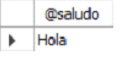
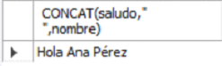
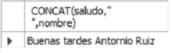
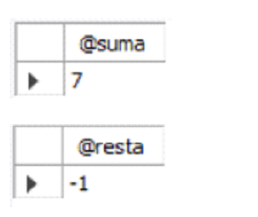
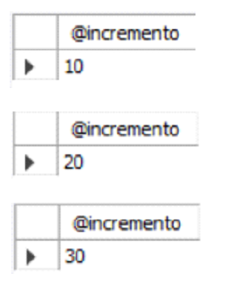
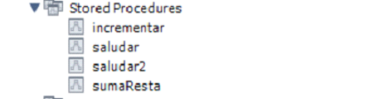

# [Bootcamp Web Developer Full Stack](https://www.thebridge.tech/bootcamps/bootcamp-fullstack-developer/)
### JS, ES6, Node.js, Frontend, Backend, Express, React, MERN, testing, DevOps

# BD Relacionales 7
## Procedimientos

Es posible que necesitemos ejecutar bloques de código bajo demanda, para generar informes por ejemplo o cuestiones similares.

En ese caso, los procedimientos son útiles, ya que realizan las tareas que sean necesarias y debemos ejecutarlos nosotros, no lo hacen respondiendo a un evento, como en el caso de los triggers.

## Conceptos previos:

Tanto los procedimientos, como las funciones, son subprogramas,	que como hemos dicho se ejecutan bajo demanda.

Un procedimiento tiene como premisa que se usa para mostrar información, realizar tareas en la Base de Datos (inserciones, actualizaciones, búsquedas o borrados) o para devolver cuestiones que calculemos, pero debe ser más de un valor, si se trata de sólo uno, sería una función, pero ya hablaremos mejor de esto.

Estos bloques de código pueden tener la necesidad de recibir información del exterior. En este punto debemos definir el concepto de parámetro (concepto general asociado a subprogramas en programación, no sólo en PL-SQL).

**Parámetros:**
Un parámetro se define como información que necesita un subprograma para trabajar y no se puede calcular, ni pedir en el propio subprograma, tiene que venir del exterior.

**Tipos de parámetros:**

- **Entrada:** Información que recibe el subprograma y que está pensada para usar y no para modificarla (Ejemplo: Si se necesita crear un subprograma que sume dos números enteros pasados por parámetros, ambos números se usarían para sumarse, pero no para modificarlos)
- **Salida:** Espacios de memoria vacíos para escribir resultados, no contienen información. Estos parámetros se usan en los procedimientos para devolver más de un valor. 
- **Entrada/Salida:** Se trata de una combinación de los dos tipos anteriores. Se trata de un hueco de memoria que contiene un valor que podemos usar y luego modificaremos para devolverlo. Estos también son usados por los procedimientos, para devolver más de un valor.

### Creación de procedimientos
**Sintaxis básica:**

```
	CREATE PROCEDURE nombreProcedimiento ([parametros[,...]]) 
	BEGIN	
		codigo
	END
```

- parametros: [ IN | OUT | INOUT] nombreParámetros tipo
- tipo: tipos de datos MySQL
- codigo: Cualquier sentencia válida en SQL

**Ejemplos:**

- Procedimiento sin parámetros: 

```
DELIMITER //
CREATE PROCEDURE saludar ()
BEGIN
	DECLARE saludo VARCHAR(100);
	SET saludo = "Hola";
	SELECT saludo;
END 
//
DELIMITER ;
```
La sentencia MySQL usada para ejecutar procedimientos es “CALL”:
```
CALL saludar();
```
**Resultado:**



- Procedimiento con parámetros de entrada: 

```
DELIMITER //
CREATE PROCEDURE saludar2 (IN saludo VARCHAR(25), IN nombre VARCHAR(100))
BEGIN
  SELECT CONCAT(saludo," ",nombre);
END;
//
DELIMITER ;
```
**Llamada 1:**

``` 
SET @saludo = "Hola";
SET @nombre = "Ana Pérez";
CALL saludar2(@saludo, @nombre);
```
**Resultado:** 

			

**Llamada 2:**
``` 
CALL saludar2("Buenas tardes", "Antornio Ruiz");
```
**Resultado:** 

		
		 
		
Al tratarse de parámetros de entrada, puedes usar variables en su ejecución, como puedes ver en la “Llamada 1” o valores literales como en la “Llamada 2”.

- Procedimiento con parámetros de salida:
```
DELIMITER //
CREATE PROCEDURE sumaResta (IN n1 INT, IN n2 INT, OUT suma INT, OUT resta INT)
BEGIN
  SET suma = n1+n2;
  SET resta = n1-n2;
END;
//
DELIMITER ;
```
**Llamada:**
``` 
CALL sumaResta (3, 4, @suma,@resta);
SELECT @suma;
SELECT @resta;
```
**Resultado:** 

		
 
- Procedimiento con parámetros de entrada/salida

```
DELIMITER //
CREATE PROCEDURE incrementar (INOUT incremento INT)
BEGIN
	SET incremento = incremento + 10;
END;
//
DELIMITER ;
```

**Llamada:** 

```
SET @incremento = 0;
CALL incrementar(@incremento);
SELECT @incremento;
CALL incrementar(@incremento);
SELECT @incremento;
CALL incrementar(@incremento);
SELECT @incremento;
```
**Resultado:** 

		
 
	
Podemos ver que todos los procedimientos se almacenan en el SGBD, lo cual permite que podamos llamarlos cada vez que nos haga falta con “CALL”: 

	
 
### Borrado de procedimientos

Para borrar un procedimiento se usa la sentencia “DROP”.

**Sintaxis básica:** 
```
	DROP PROCEDURE nombreProcedimiento;
```

No puede haber en la Base de Datos dos procedimientos que se llamen igual, por lo que el borrado no puede llevar a confusión.

