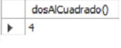
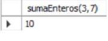
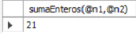

# [Bootcamp Web Developer Full Stack](https://www.thebridge.tech/bootcamps/bootcamp-fullstack-developer/)
### JS, ES6, Node.js, Frontend, Backend, Express, React, MERN, testing, DevOps

# BD Relacionales 8
## Funciones

Este tipo de bloques de código son muy similares a los procedimientos, pero con algunas limitaciones.

- El propósito de las funciones es **calcular un único valor.**

### Conceptos

Características de las funciones (a nivel de programación general): 

- Siempre devuelven un único valor (Ejemplo, media de ingresos de todo el año, información que puede estar en varias tablas)
- Sus parámetros deberían ser sólo de entrada
- Devuelven usando la sentencia “RETURN”
- Hay que especificar el tipo de datos que devuelve usando la sentencia “RETURNS”

## Creación de funciones

Vamos a pasar a ver su sintaxis en MySQL y ejemplos, ya que es la mejor manera de entenderlas.

**Sintaxis básica:**
```
CREATE FUNCTION nombreFuncion ([parametros[,...]])
RETURNS tipo
BEGIN    
	codigo
	RETURN valor
END
```
- parametros: nombreParámetros tipo

- tipo: tipos de datos MySQL

- codigo: Cualquier sentencia válida en SQL

**Ejemplos:** 

- Función sin parámetros:

```
	DELIMITER //
	CREATE FUNCTION dosAlCuadrado ()
	RETURNS INT DETERMINISTIC
	BEGIN
		RETURN 2*2;
	END
	//
	DELIMITER ;
```
**Llamada:** 
```
	SELECT dosAlCuadrado();    
```

**Resutltado:** 

				
		 

- Función con parámetros:

```
DELIMITER //
CREATE FUNCTION sumaEnteros (n1 INT, n2 INT)
RETURNS INT DETERMINISTIC
BEGIN
	RETURN n1+n2;
END
//
DELIMITER ;
```
**Llamada 1:** 

```
SELECT sumaEnteros(3,7);
```

**Resultado:**

 

**Llamada 2:** 

```
SET @n1 = 10;
SET @n2 = 11;

SELECT sumaEnteros(@n1,@n2);
```

**Resultado:**



			
De nuevo, como sucedió en los procedimientos, cuando se trata de parámetros de entrada, podemos pasar valores literales, como en la “Llamada 1” o variables como en la “Llamada 2”.

### Borrado de funciones
Para borrar una función se usa la sentencia “DROP”.

**Sintaxis básica:** 
```
DROP FUNCTION nombreFuncion;
```

No puede haber en la Base de Datos dos funciones que se llamen igual, por lo que el borrado no puede llevar a confusión
		
