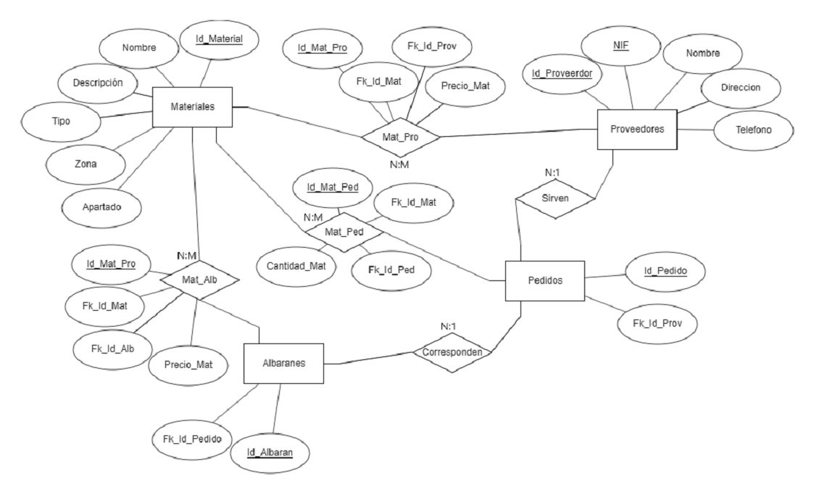

# [Bootcamp Web Developer Full Stack](https://www.thebridge.tech/bootcamps/bootcamp-fullstack-developer/)
### JS, ES6, Node.js, Frontend, Backend, Express, React, MERN, testing, DevOps

# BD Relacionales 8
## Ejercicios

1. Crea los triggers necesarios y las tablas necesarias para resolver lo siguiente: 
- Cuando se produce una acción (inserción o borrado) en una tabla Clientes (que contiene id, nombre, telefono y DNI) se pase la información a otra tabla que se va a llamar Copia_Clientes
2. Crea un procedimiento que sume, reste, multiplique y divida dos números enteros.
3. Crea una función que extraiga usando un bucle el mayor id de un cliente de los que se encuentran en la tabla del ejercicio 1.
4. A partir de la siguiente BD: 
```
#DROP DATABASE EjercicioCompleto;
CREATE DATABASE EjercicioCompleto;
USE EjercicioCompleto;

CREATE TABLE Materiales (
    id_material INT AUTO_INCREMENT,
    nombre VARCHAR(20) NOT NULL,
    descripcion VARCHAR(100) NOT NULL,
    tipo VARCHAR(20) NOT NULL,
    zona CHAR(2),
    apartado VARCHAR(2),
    PRIMARY KEY (id_material)
);

CREATE TABLE Proveedores (
    id_proveedor INT AUTO_INCREMENT,
    nif VARCHAR(12) UNIQUE NOT NULL,
    nombre VARCHAR(30) NOT NULL,
    direccion VARCHAR(100) NOT NULL,
    telefono VARCHAR(15),
    PRIMARY KEY (id_proveedor)
);

CREATE TABLE Materiales_Proveedores (
    id_materiales_proveedores INT AUTO_INCREMENT,
    precio_material FLOAT(6,2) NOT NULL,
    fk_id_material INT,
    fk_id_proveedor INT,
    PRIMARY KEY (id_materiales_proveedores),
    FOREIGN KEY (fk_id_material)
    REFERENCES Materiales(id_material)
    ON DELETE CASCADE,
    FOREIGN KEY (fk_id_proveedor)
    REFERENCES Proveedores(id_proveedor)
    ON DELETE CASCADE
);

CREATE TABLE Pedidos (
    id_pedido INT AUTO_INCREMENT,
    fk_id_proveedor INT,
    PRIMARY KEY(id_pedido),
    FOREIGN KEY (fk_id_proveedor)
    REFERENCES Proveedores(id_proveedor)
    ON DELETE CASCADE
);

CREATE TABLE Materiales_Pedidos(
    id_materiales_pedidos INT AUTO_INCREMENT,
    cantidad_material INT NOT NULL,
    precio_material FLOAT(6,2) NOT NULL,
    fk_id_material INT,
    fk_id_pedido INT,
    PRIMARY KEY (id_materiales_pedidos),
    FOREIGN KEY (fk_id_material)
    REFERENCES Materiales(id_material)
    ON DELETE CASCADE,
    FOREIGN KEY (fk_id_pedido)
    REFERENCES Pedidos(id_pedido)
    ON DELETE CASCADE
);

CREATE TABLE Albaranes (
    id_albaran INT AUTO_INCREMENT,
    fk_id_pedido INT,
    PRIMARY KEY (id_albaran),
    FOREIGN KEY (fk_id_pedido)
    REFERENCES Pedidos(id_pedido)
    ON DELETE CASCADE
);

CREATE TABLE Materiales_Albaranes(
    id_materiales_albaranes INT AUTO_INCREMENT,
    precio_material FLOAT(6,2) NOT NULL,
    fk_id_material INT,
    fk_id_albaran INT,
    PRIMARY KEY (id_materiales_albaranes),
    FOREIGN KEY (fk_id_material)
    REFERENCES Materiales(id_material)
    ON DELETE CASCADE,
    FOREIGN KEY (fk_id_albaran)
    REFERENCES Albaranes(id_albaran)
    ON DELETE CASCADE
);

CREATE TABLE Reclamaciones(
    id_reclamacion INT AUTO_INCREMENT,
    precio_establecido FLOAT(6,2) NOT NULL,
    precio_cobrado FLOAT (6,2) NOT NULL,
    diferencia FLOAT (6,2) NOT NULL,
    fk_id_albaran INT, 
    PRIMARY KEY (id_reclamacion),
    FOREIGN KEY (fk_id_albaran)
    REFERENCES Albaranes(id_albaran)
    ON DELETE CASCADE
);

INSERT INTO Materiales 
VALUES (null, "Ladrillo", "ladrillo de 20x60", "interor", "B", "1");
INSERT INTO Materiales 
VALUES (null, "Marmol", "bloque de marmol de 1x1", "cocina", "C", "2");
INSERT INTO Materiales 
VALUES (null, "Cemento", "Saco de 10 kg de cemento", "exterior", "A", "3");
INSERT INTO Materiales 
VALUES (null, "Pintura azul", "Pintura azul claro para exteriores", "exterior", "C", "1");
INSERT INTO Materiales 
VALUES (null, "Cobertura ", "Cobertura plastica de imitacion", "techo", "B", "3");


INSERT INTO Proveedores 
VALUES(null, "546351256G", "Ladrillos la piedra SL", "Calle San Geronimo 28043 Madrid", 910090287);
INSERT INTO Proveedores 
VALUES(null, "653718356Y", "Minerales San Cruz S.L", "Calle Pedro Alonso 43001 Tarragona", 911129324);
INSERT INTO Proveedores 
VALUES(null, "653718306Y", "CONSTRUCCION S.L", "Calle Falsa 123 28032 Madrid", 910929414);
INSERT INTO Proveedores 
VALUES(6, "650018356Y", "Manolo´s SL", "Calle Velazquez 14 30100 Murcia", 910929414);

INSERT INTO Materiales_Proveedores VALUES (null, 1.45, 1, 1);
INSERT INTO Materiales_Proveedores VALUES (null, 7.56, 2, 2);
INSERT INTO Materiales_Proveedores VALUES (null, 7.56, 3, 3);

INSERT INTO Pedidos VALUES (null, 1);
INSERT INTO Pedidos VALUES (null, 2);

INSERT INTO Materiales_Pedidos VALUES (null, 120, 1.51, 1, 1);
INSERT INTO Materiales_Pedidos VALUES (null, 6, 8.92, 3, 2);


INSERT INTO Albaranes VALUES (null, 1);
INSERT INTO Albaranes VALUES (null, 2);

INSERT INTO Materiales_Albaranes VALUES (null, 1.49, 1, 1);
INSERT INTO Materiales_Albaranes VALUES (null, 7.89, 3, 2);

INSERT INTO Pedidos VALUES (11, 1);
INSERT INTO Proveedores VALUES(7, "120018356F", "Basquim sl", "Poligono industrial san fernando 28851 Madrid", 910929414);
INSERT INTO Materiales_Pedidos VALUES (11, 10, 3.21, 3, 11);

INSERT INTO Pedidos VALUES (3, 6);
INSERT INTO Albaranes VALUES (null, 3);
INSERT INTO Albaranes VALUES (null, 3);

INSERT INTO Proveedores VALUES(null, "650015126Y", "ESTRUCTURAS S.L", "Calle Islandia 28821 Coslada, Madrid", 910952814);
INSERT INTO Pedidos VALUES (4, 8);
INSERT INTO Albaranes VALUES (null, 4);

INSERT INTO Pedidos VALUES (6, 1);
INSERT INTO Materiales_Pedidos VALUES (null, 8, 2.89, 1, 6);   
INSERT INTO Albaranes VALUES (11, 6);
INSERT INTO Materiales_Albaranes VALUES (null, 1.49, 4, 11); 

```
- Desarrollar un trigger asociado a la inserción en Albaranes, que se debe llevar a cabo antes de insertar y funcionar de la siguiente manera:
Si el precio de venta no se corresponde con el que tenemos registrado del proveedor (la diferencia debe ser como máximo 2 €), se debe borrar el registro de Albaranes y pasarlo a Albaranes_Reclamacion (tabla que se debe crear antes, con los mismos campos que Albaranes)
- Desarrollar un trigger asociado a la actualización de Materiales, que se debe llevar a cabo tras actualizar la descripción y debe pasar la antigua descripción a una tabla llamada “Descripciones” (se debe crear antes y sólo tiene id, id del material cambiado y descripción)
- Desarrollar un trigger asociado al borrado de Pedidos, se debe llevar a cabo después de borrar, de manera que se borren los albaranes asociados a ese pedido

**Diagrama de ayuda:**



**Ejemplos cursores:**

```
#DROP DATABASE Hospital;
CREATE DATABASE Hospital;

USE Hospital;

CREATE TABLE Camas(
	id_cama INT AUTO_INCREMENT,
    zona VARCHAR(50), 
    planta VARCHAR(50) NOT NULL,
    fechaCambioSabanas DATE NOT NULL, 
    PRIMARY KEY(id_cama)
);

INSERT INTO Camas VALUES(null, "pediatría", "Primera", "2020/01/29");
INSERT INTO Camas VALUES(null, "cardiología", "Primera", "2020/01/30");
INSERT INTO Camas VALUES(null, "traumatología", "Segunda", "2020/02/15");
INSERT INTO Camas VALUES(null, "traumatología", "Segunda", "2020/02/16");
INSERT INTO Camas VALUES(null, "obstetricia", "Tercera", "2020/01/29");
INSERT INTO Camas VALUES(null, "ginecología", "Cuarta", "2020/01/29");

CREATE TABLE Pacientes(
	id_paciente INT AUTO_INCREMENT,
    nombre VARCHAR(100),
    apellido1 VARCHAR(100),
    dni CHAR(9) NOT NULL,
    fechaIngreso DATE,
    fk_id_cama INT,
    PRIMARY KEY(id_paciente), 
    FOREIGN KEY(fk_id_cama)
    REFERENCES Camas(id_cama)
);
INSERT INTO Pacientes VALUES(null, "María", "Pérez", "11111111A", "2020/01/28", 1);
INSERT INTO Pacientes VALUES(null, "María", "Pérez", "11111111A", "2020/02/14", 3);
INSERT INTO Pacientes VALUES(null, "María", "Pérez", "11111111A", "2020/02/29", 2);
INSERT INTO Pacientes VALUES(null, "José", "Ramirez", "22222222B", "2020/02/10", 3);
INSERT INTO Pacientes VALUES(null, "Rafael", "Hernández", "33333333C", "2020/01/09", 4);
INSERT INTO Pacientes VALUES(null, "Ana", "Rodríguez", "44444444D", "2020/01/26", 6);
INSERT INTO Pacientes VALUES(null, "Ana", "Rodríguez", "44444444D", "2020/01/27", 5);

CREATE TABLE Medicos(
    id_medico INT AUTO_INCREMENT,
    nombre VARCHAR(100),
    apellido1 VARCHAR(100),
    apellido2 VARCHAR(100),
    dni CHAR(9) UNIQUE NOT NULL,
    turno VARCHAR(50), 
    especialidad VARCHAR(100) NOT NULL, 
    PRIMARY KEY(id_medico) 
);
INSERT INTO Medicos VALUES(null, "Rosa", "Hernández", "Ruíz", "55555555A", "Mañana", "pediatría");
INSERT INTO Medicos VALUES(null, "Juan", "Ruíz", "Ruíz", "55555555B", "Tarde", "pediatría");
INSERT INTO Medicos VALUES(null, "Carlos", "Blanco", "Pérez", "55555555C", "Mañana", "cardiología");
INSERT INTO Medicos VALUES(null, "Carlos", "Hernández", "Pérez", "55555555D", "Tarde", "cardiología");
INSERT INTO Medicos VALUES(null, "Ana", "Ramirez", "Pérez", "55555555E", "Mañana", "traumatología");
INSERT INTO Medicos VALUES(null, "Rita", "Betancort", "Pérez", "55555555F", "Tarde", "traumatología");
INSERT INTO Medicos VALUES(null, "Juan", "Ramirez", "Seoane", "55555555G", "Mañana", "obstetricia");
INSERT INTO Medicos VALUES(null, "David", "Díaz", "Pérez", "55555555H", "Tarde", "obstetricia");
INSERT INTO Medicos VALUES(null, "Gabriela", "Martínez", "Seoane", "55555555I", "Mañana", "ginecología");
INSERT INTO Medicos VALUES(null, "Óscar", "Martínez", "Pérez", "55555555J", "Tarde", "ginecología");


CREATE TABLE Pacientes_Medicos(
    id_paciente_medico INT AUTO_INCREMENT,
    fk_id_paciente INT,
    fk_id_medico INT,
    PRIMARY KEY(id_paciente_medico), 
    FOREIGN KEY(fk_id_paciente)
    REFERENCES Pacientes(id_paciente),
    FOREIGN KEY(fk_id_medico)
    REFERENCES Medicos(id_medico)
);

INSERT INTO Pacientes_Medicos VALUES(null, 1, 1);
INSERT INTO Pacientes_Medicos VALUES(null, 1, 2);
INSERT INTO Pacientes_Medicos VALUES(null, 2, 3);
INSERT INTO Pacientes_Medicos VALUES(null, 3, 5);
INSERT INTO Pacientes_Medicos VALUES(null, 4, 6);
INSERT INTO Pacientes_Medicos VALUES(null, 5, 6);
INSERT INTO Pacientes_Medicos VALUES(null, 5, 5);
INSERT INTO Pacientes_Medicos VALUES(null, 6, 9);
INSERT INTO Pacientes_Medicos VALUES(null, 6, 10);
INSERT INTO Pacientes_Medicos VALUES(null, 7, 7);
```

```
DELIMITER $$
CREATE PROCEDURE simple_loop ( )
BEGIN
  DECLARE counter BIGINT DEFAULT 0;
 
  my_loop: LOOP
    SET counter=counter+1;

    IF counter=10 THEN
      LEAVE my_loop;
    END IF;

    SELECT counter;

  END LOOP my_loop;
END$$
DELIMITER ;

CALL simple_loop();

DELIMITER // 
CREATE PROCEDURE mostrar_plantas() 
BEGIN
    DECLARE nCamas INT;
    DECLARE cont INT;
    DECLARE p VARCHAR(50);
    DECLARE c1 cursor for SELECT planta FROM Camas;
    
    SET cont = 0;
    SELECT COUNT(*) INTO nCamas FROM Camas;
    open c1;
	c1_loop: LOOP
		SET cont = cont + 1;
		fetch c1 into p;
        	SELECT p;
        
		IF cont = nCamas  then
			LEAVE c1_loop;
		END IF;
	END LOOP c1_loop;
	CLOSE c1;
END //
DELIMITER ;

CALL mostrar_plantas();

INSERT INTO Camas VALUES (NULL, "A", "3", "2000-3-3");

CALL mostrar_plantas();

DELIMITER $$
CREATE PROCEDURE simple_cursor( )
BEGIN
  DECLARE fin INTEGER DEFAULT 0;
  DECLARE id INT;
  DECLARE c1 cursor for SELECT id_cama FROM Camas;
  DECLARE CONTINUE HANDLER FOR NOT FOUND SET fin=1;
 
  open c1;
  my_loop: LOOP
    fetch c1 into id;

    IF fin=1 THEN
      LEAVE my_loop;
    END IF;
    
    SELECT id;

  END LOOP my_loop;
END$$
DELIMITER ;
CALL simple_cursor();
```
