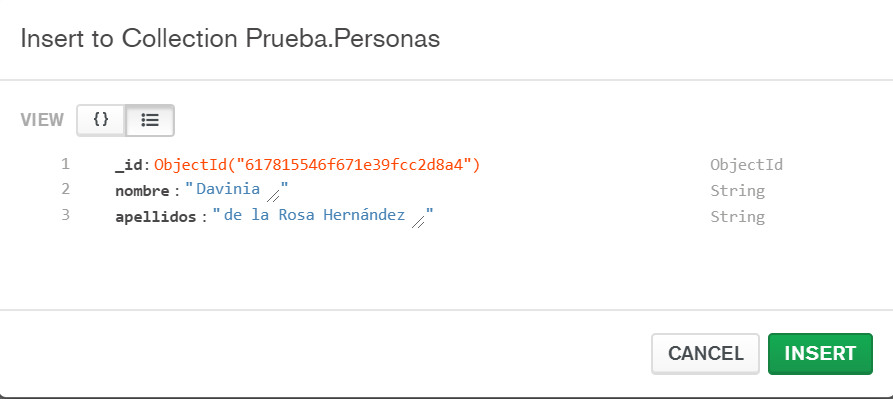

# [Bootcamp Web Developer Full Stack](https://www.thebridge.tech/bootcamps/bootcamp-fullstack-developer/)
### JS, ES6, Node.js, Frontend, Backend, Express, React, MERN, testing, DevOps

# NO SQL 2

## MongoDB

MongoDB es una BD NoSQL que se basa en colecciones (conceptualmente lo más parecido a Tablas en BD Relacionales) y documentos (conceptualmente lo más parecido a registros en BD Relacionales) y el formato de la información es JSON. 

[Documentación MongoDB](https://docs.mongodb.com/guides/)

### Instalación
Se trata de una instalación sencilla, puedes encontrar el enlace aquí:

[Instalador Mongo](https://www.mongodb.com/try/download/community)

### Conexión

En la instalación se nos crea una conexión por defecto, sólo debemos pulsar en "Connect".

### Crear una BD

Para crear una BD nueva, debemos indicar su nombre y al menos el nombre de una colección que nos insertará vacía.

### BDs creadas

Una vez hecho podremos ver nuestras BD, tanto las que contienen metadatos, como la que hemos creado.

### Ver la colección Personas dentro de la BD Prueba

Si accedemos a Prueb, nuestra BD, podremos ver las colecciones que tiene, en este caso hemos creado una llamada "Personas"

### Añadir datos a una colección

Una vez creada la colección, podremos añadirle datos, bien desde un JSON en un fichero o a mano.

Y aquí podemos ver el dato insertado: 

### Búsquedas simples aplicando filtros por medio de la Interfaz gráfica

Para aplicar filtros usamos también el formato JSON.

**Ejemplo:**

## Ejercicios
1. Crea una nueva BD en Mongo que permita almacenar un listado de Contactos de una agenda. De cada contacto tenemos su nombre, podemos tener 3 teléfonos (uno de ellos como mínimo) y hasta dos emails (ninguno obligatorio). Crea al menos 5 contactos con combinaciones diferentes de los datos.
2. Obten un contacto a partir de un email usando filtros.
3. Crea una nueva BD que permita almacenar los datos de Autores y Libros (Autores tienen como datos el nombre, apellidos, año de nacimiento y el tipo de libros que escribe. Libros disponen de título, ISBN, tipo y número de páginas), puede que alguno de los datos no estén disponibles, pero los autores tienen que tener apellidos sí o sí y los libros el ISBN. Inserta al menos 5 autores y 5 libros y relaciónalos.
4. Obten un autor filtrando por apellidos y un libro filtrando por ISBN.
5. Crea una BD que permita almacenar los datos del ejercicio 3 de JSON.
6. Obten la información de las compras de un cliente.
