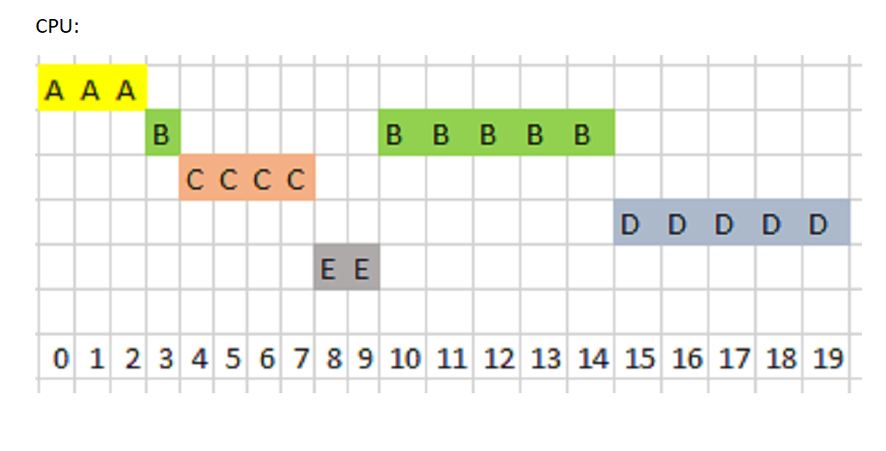

# [Bootcamp Web Developer Full Stack](https://www.thebridge.tech/bootcamps/bootcamp-fullstack-developer/)
### JS, ES6, Node.js, Frontend, Backend, Express, React, MERN, testing, DevOps

## Procesos y sus estados
Un proceso, en informática, puede entenderse informalmente como un programa en ejecución. Formalmente un proceso es "Una unidad de actividad que se caracteriza por la ejecución de una secuencia de instrucciones, un estado actual, y un conjunto de recursos del sistema asociados".

Los diferentes estados por los que puede pasar son: 

## Algoritmos de planificación de procesos
El mayor problema al que se enfrenta un S.O es la concurrencia, en este caso vamos a verla a nivel de CPU. Lo que debe organizar el S.O es el procesamiento de las tareas de los procesos por medio de la CPU.

Los algoritmos son 4, veamos ejemplos de ellos: 

### FIFO (First In, First Out): 

Algoritmo no expulsivo en el que el primero en llegar es el primero en acceder a la CPU.

### Ejemplo: 

**Enunciado:**

**Cola:**

**CPU:**

### SJF (Shortest Job First): 

Algoritmo no expulsivo en el accede a la CPU el más corto que se encuentra en la cola, por tanto es importante la llegada, pero lo que decide el acceso a la CPU es la cantidad de tiempo que necesita para ser procesado

### Ejemplo: 

**Enunciado:**

**Cola:**

**CPU:**

### SRTF (Short Remaining Time First):

Algoritmo expulsivo en el que se expulsa por tiempo restante de procesamiento. 
Si un proceso llega a la cola y necesita menos tiempo de ejecución que el que se encuentra en la CPU, le expulsa y pasa a ser procesado.

### Ejemplo: 

**Enunciado:**

**Cola:**

**CPU:**

### RR (Round Robin):

Algoritmo expulsivo que basándose en un quantum de tiempo (Q), asigna un tiempo fijo de CPU por turnos a todos los procesos de la cola y les va expulsando.

### Ejemplo: 

**Enunciado:**

**Cola:**

**CPU:**

## Ejercicios
Para la siguiente tabla: 

Realiza: 

1. SRTF
2. RR Q=3
