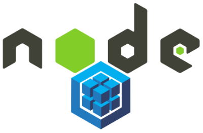

# [Bootcamp Web Developer Full Stack](https://www.thebridge.tech/bootcamps/bootcamp-fullstack-developer/)
### JS, ES6, Node.js, Frontend, Backend, Express, React, MERN, testing, DevOps

# Primer ejemplo Sequelize


### Script inicial

Se debe crear antes de iniciar, un proyecto node, instalar **sequelize**, **mysql** y **mysql2**.

Además se debe crear una BD en Workbench llamada **test** con una tabla **users**.


```javascript 

    const Sequelize = require('sequelize')

    const sequelize = new Sequelize('test', 'root', 'root', {
    host: 'localhost',
    dialect: 'mysql',
    port: 3306
    })

    sequelize.authenticate()
    .then(() => {
        console.log('Conectado')
    })
    .catch(err => {
        console.log('No se conecto')
    });

    const User = sequelize.define('users', {
        id: {type: Sequelize.INTEGER, primaryKey: true},
        firstname: Sequelize.STRING,
        lastname: Sequelize.STRING
    });

    User.findAll({ attributes: ['id','firstname', 'lastname'] })
    .then(users => {
        console.log(users[0].dataValues)
    })
    .catch(err => {
        console.log(err)
    });


```


