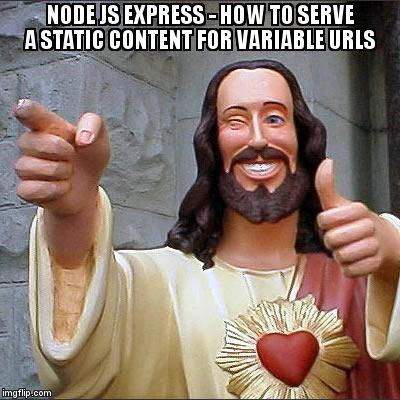
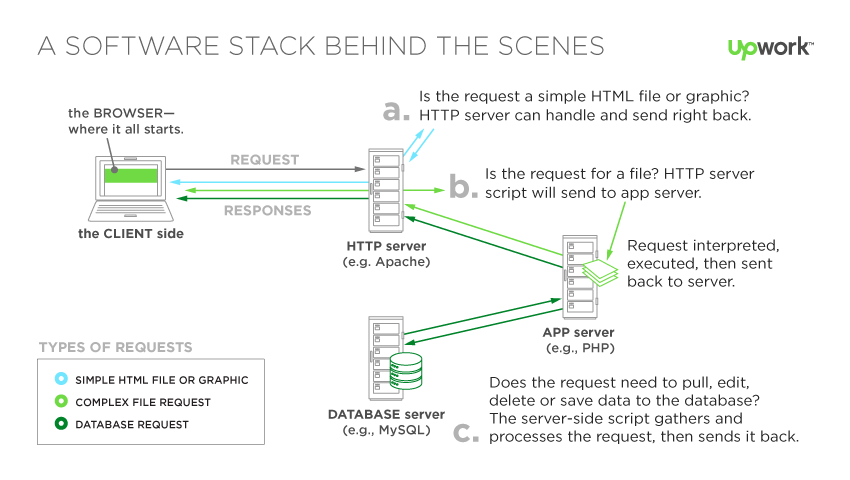

# [Bootcamp Web Developer Full Stack](https://www.thebridge.tech/bootcamps/bootcamp-fullstack-developer/)
### JS, ES6, Node.js, Frontend, Backend, Express, React, MERN, testing, DevOps

## Clase 22

### Express: Routing


### Intro a Express con Node.js


- [Express](http://expressjs.com/)
- [Ranking de frameworks JS](https://hotframeworks.com/languages/javascript)
- [Going out to eat and understanding the basics of Express.js](https://www.freecodecamp.org/news/going-out-to-eat-and-understanding-the-basics-of-express-js-f034a029fb66/ )
- [node-js-express](https://guru99.es/node-js-express/)
- [express-explained-with-examples](https://www.freecodecamp.org/news/express-explained-with-examples-installation-routing-middleware-and-more/)

### Instalación de Express
- [Instalación](https://expressjs.com/en/starter/installing.html)
- [Hello World con Express](https://expressjs.com/en/starter/hello-world.html)

### API de Express
- [API Express](https://expressjs.com/es/4x/api.html)
- [Objeto Request](https://expressjs.com/es/4x/api.html#req) 
- [Objeto Response](https://expressjs.com/es/4x/api.html#res) 
- [Objeto Router](https://expressjs.com/es/4x/api.html#router) 

### Routing con Express
- [Routing básico](https://expressjs.com/es/starter/basic-routing.html)
- [Routing con Express](https://expressjs.com/es/guide/routing.html)
- [Routing - tutorialspoint](https://www.tutorialspoint.com/expressjs/expressjs_routing.htm)

### Archivos estáticos y carpeta public
- [Servir archivos estáticos](http://expressjs.com/es/starter/static-files.html)
- [Serving-static-files-in-express](https://www.digitalocean.com/community/tutorials/nodejs-serving-static-files-in-express)


### Modularizar rutas con Express
Objetivo: Separar módulos con funcionalidades aparte del script de rutas principal

- [route-separation](https://github.com/expressjs/express/blob/4.13.1/examples/route-separation/index.js#L32-47)
- [building-a-node-js-rest-api-with-express](https://medium.com/@jeffandersen/building-a-node-js-rest-api-with-express-46b0901f29b6)
- [how-to-modularize-routes-with-the-express-router](https://medium.com/@catherinelau/how-to-modularize-routes-with-the-express-router-5ce46f9bb2bd)
- [keeping-api-routing-clean-using-express-routers](https://scotch.io/tutorials/keeping-api-routing-clean-using-express-routers)
- [express-explained-with-examples](https://www.freecodecamp.org/news/express-explained-with-examples-installation-routing-middleware-and-more/)
- [learn-nodejs-expressjs](https://developer.ibm.com/languages/node-js/tutorials/learn-nodejs-expressjs/)

### Lanzar peticiones sin navegador(cliente)
- [Postman](https://www.postman.com/)
- [Advanced REST client](https://chrome.google.com/webstore/detail/advanced-rest-client/hgmloofddffdnphfgcellkdfbfbjeloo?hl=es)

**Por consola de comandos: CURL**
- [Web Oficial](https://curl.haxx.se/)
- [curl Docs | How To Use](https://curl.haxx.se/docs/manpage.html)
- [curl Docs | Manual](https://curl.haxx.se/docs/manual.html)
- [cURL Command Examples](https://www.rosehosting.com/blog/curl-command-examples/)

### Estructura de carpetas en Express
- [understanding-node-js-express-js-fundamentals](https://medium.com/@LindaVivah/the-beginners-guide-understanding-node-js-express-js-fundamentals-e15493462be1)

### Autogenerar un proyecto
- [Express generator](https://expressjs.com/es/starter/generator.html)

### Server Side Rendering


- Lógica de negocio en el backend
- El backend realiza todas las consultas y obtiene la información
- De forma dinámica el Backend genera una respuesta con un contenido HTML válido
- El javascript del front se limita a la interacción con el usuario. No gestiona data como en arquitecturas SPA (Single Page Application)

### Templates Engine - Express + Pug


**Recursos**
- [Web Oficial](https://pugjs.org)
- [Docs | Getting Started](https://pugjs.org/api/getting-started.html)
- [Docs | Express Integration](https://pugjs.org/api/express.html)
- [Docs | API Reference](https://pugjs.org/api/reference.html)
- [Github | Pugjs](https://github.com/pugjs/pug)
- [The Pug Life — A Quick Intro to PugJS](https://medium.com/@andrewtsao/the-pug-life-a-quick-intro-to-pugjs-40b0895bdd5b)
- [A Better Way to Write HTML, PugJS](https://medium.com/@cmpbilge/a-better-way-to-write-html-pugjs-e46e5b03ebd8)
- [What is Pug.js (Jade) and How can we use it within a Node.js Web Application?](https://codeburst.io/what-is-pug-js-jade-and-how-can-we-use-it-within-a-node-js-web-application-69a092d388eb)
- [Getting started with pug template engine](https://codeburst.io/getting-started-with-pug-template-engine-e49cfa291e33)
- [Expressjs templating](https://www.tutorialspoint.com/expressjs/expressjs_templating.htm)

**Herramientas**
- [Html2Jade](http://html2jade.org/)
- [Pug2html](https://pughtml.com/)


### EJERCICIOS

### Ejercicio - Weather APP
Construye una APP del Tiempo siguiendo el siguiente tutorial. Usaremos Node.js + Express + OpenWeather API

- [Ejercicio Weather APP](https://codeburst.io/build-a-weather-website-in-30-minutes-with-node-js-express-openweather-a317f904897b )

### Ejercicio - Templates con Node.js + Express: 


En este ejercicio aplicaremos todo lo que hemos visto anteriormente: 

- Las vistas serán renderizadas como templates PUG
- Usaremos módulos separados como lo que hemos visto en clase
- Crearemos rutas básicas con express para servir una página web clásica
(Home| ¿Quiénes somos? | ¿Dónde Estamos? | ¿Qué hacemos? | Contacto... etc...)
- ¿Llegaste aquí? Sirve en respuesta a la petición de cada ruta(endpoint) la vista correspondiente según lo que hemos visto con el uso de Templates con PUG
- Probar el uso de la carpeta `public` para servir tus ficheros estáticos de las carpetas `css` `img` y  `js` en la vista correspodiente para que pueda navegar el cliente, dar estilos y efectos
- Prueba a pasar variables al template de pug para conseguir renderizar distintas vistas con una misma plantilla
- La app se debe iniciar con el comando `npm start`

Endpoints de ejemplo:
```javascript
GET http://localhost:3000/
GET http://localhost:3000/about
GET http://localhost:3000/location
GET http://localhost:3000/mission
GET http://localhost:3000/contact
```


