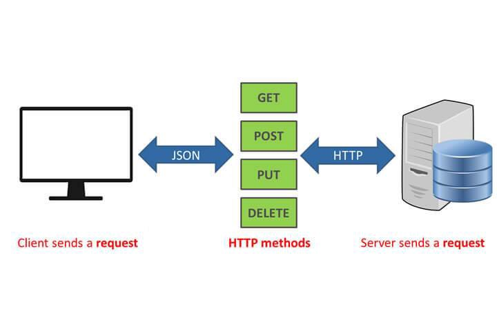
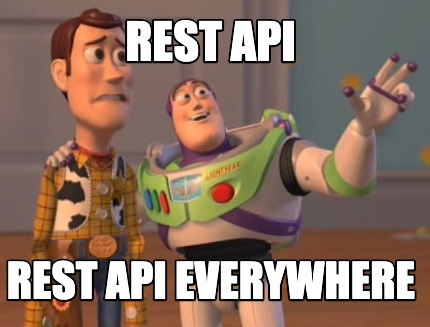

# [Bootcamp Web Developer Full Stack](https://www.thebridge.tech/bootcamps/bootcamp-fullstack-developer/)
### JS, ES6, Node.js, Frontend, Backend, Express, React, MERN, testing, DevOps

## Clase 24

### Express(II): API REST


### Teoría - API REST


API es un conjunto de reglas y especificaciones que las aplicaciones pueden seguir para comunicarse entre ellas. Para que lo entendamos, el uso de una API es el mecanismo más útil para conectar dos softwares entre sí, de esta manera, podemos garantizar el intercambio de mensajes o datos en formato estándar.

Las operaciones más importantes relacionadas con los datos en cualquier sistema REST y la especificación HTTP son cuatro; POST (crear), GET (leer y consultar), PUT (editar) y DELETE (borrar).

Rest, que es la abreviación de Representational State Transfer, es un conjunto de restricciones que se utilizan para que las solicitudes HTTP cumplan con las directrizes definidas en la arquitectura.




Ejemplos de peticiones:
```javascript
HTTP GET http://www.appdomain.com/users
HTTP GET http://www.appdomain.com/users?size=20&page=5
HTTP GET http://www.appdomain.com/users/123
HTTP GET http://www.appdomain.com/users/123/address
HTTP POST http://www.appdomain.com/users
HTTP POST http://www.appdomain.com/users/123/accounts

HTTP PUT http://www.appdomain.com/users/123
HTTP PUT http://www.appdomain.com/users/123/accounts/456

HTTP DELETE http://www.appdomain.com/users/123
HTTP DELETE http://www.appdomain.com/users/123/accounts/456
```
Más sobre API REST:
- [que-es-api-rest-integrar-negocio-business-tech](https://www.iebschool.com/blog/que-es-api-rest-integrar-negocio-business-tech/)
- [api-rest](https://rockcontent.com/es/blog/api-rest/)
- [a-beginners-guide-to-http-and-rest](https://code.tutsplus.com/es/tutorials/a-beginners-guide-to-http-and-rest--net-16340)
- [Ejemplos de peticiones REST](https://restfulapi.net/http-methods/)

### Crear una API REST con Express
- [routing-with-express-and-postman](https://iq.opengenus.org/routing-with-express-and-postman/)
- [nodejs-express-routing](https://www.digitalocean.com/community/tutorials/nodejs-express-routing)
- [building-a-node-js-rest-api-with-express](https://medium.com/@jeffandersen/building-a-node-js-rest-api-with-express-46b0901f29b6)
- [desarrollando-una-sencilla-api-rest-con-nodejs-y-express](https://asfo.medium.com/desarrollando-una-sencilla-api-rest-con-nodejs-y-express-cab0813f7e4b)

### EJERCICIO - API REST con Express



Crea una aplicación de películas para hacer una API REST con Express. Para ello usa la API de pelis que te proporcionamos
- [OMDB api](http://www.omdbapi.com/)

OJO!: Crea desde cero un repositorio en GitHub para hacer el ejercicio

Rutas:
- [GET] `http://localhost:3000/api/film/:title` Retorna un JSON con los detalles de la peli en concreto buscada. Payload  {titulo:"Titanic", autor:"James Cameron", descripción:"xxx", src:"titanic.png",etc...}
- [POST] `http://localhost:3000/api/film/` Se envía por POST los datos de la película a crear y retorna un status 200. Payload {message: "Se ha guardado Titanic"}
- [PUT] `http://localhost:3000/api/film/` Actualiza los datos de una película y retorna un status 200. Payload {id:"0", message: "Se ha actualizado Titanic"}
- [DELETE] `http://localhost:3000/api/film/` Borra una película y retorna un status 200. Payload {id: "0", message: "Se ha borrado Titanic"}
- En caso de ruta no encontrada o error, devolver un mensaje de error. Especificar si ha sido un 404, 500, etc...
 - [error-handling](https://expressjs.com/es/guide/error-handling.html)
 - [how-to-handle-404-and-500-errors-on-expressjs](https://davidburgos.blog/how-to-handle-404-and-500-errors-on-expressjs/)

Estructura del proyecto:
- Guarda en otro módulo dentro de la carpeta `utils` (hay que crearla) el código para hacer fetch de la peli. Importa dicho módulo para usarlo en el sitio adecuado...
- ¿Cansado de publicar tus API_KEY privadas al mundo exterior cuando subes tu código a GitHub? Prueba a crearte un fichero `.env` en el que pongas tus claves privadas y añade a `.gitignore` la directriz para ignorar el fichero `.env` al subir a GitHub.
- [https://www.npmjs.com/package/dotenv](https://www.npmjs.com/package/dotenv)
- [environment-variables](https://medium.com/the-node-js-collection/making-your-node-js-work-everywhere-with-environment-variables-2da8cdf6e786)