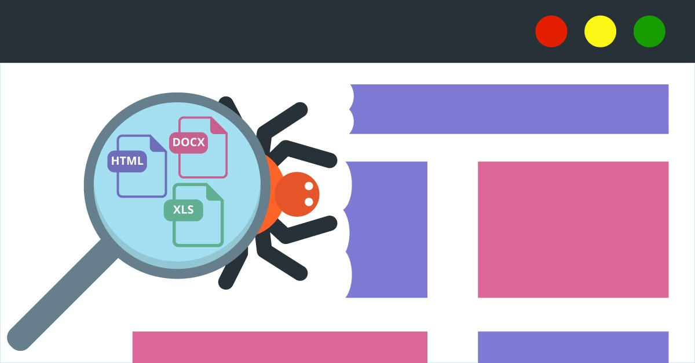

# [Bootcamp Web Developer Full Stack](https://www.thebridge.tech/bootcamps/bootcamp-fullstack-developer/)
### JS, ES6, Node.js, Frontend, Backend, Express, React, MERN, testing, DevOps

## Clase 26

## Web scraping
>Web scraping o raspado web, es una técnica utilizada mediante programas de software para **extraer información de sitios web** de manera automatizada. Usualmente, estos programas simulan la navegación de un humano en la World Wide Web ya sea utilizando el protocolo HTTP manualmente, o incrustando un navegador en una aplicación.
[Wikipedia](https://es.wikipedia.org/wiki/Web_scraping)

 
 

 
 
 
### **Algunos casos de uso de Web Scraping**

 

- Motores de búsqueda: Google, Yahoo, Bing, DuckDuckGo, etc.

- Comparación de precios en tiendas. Metabuscadores como: Trivago, Rastreator, Atrápalo.

- Otro tipo de metabuscadores como pueden ser algunos portales de empleo.

- Aplicaciones que requieran datos públicos de terceros. 

- Reunir datos de contacto de empresas o personas a partir de sitios como linkedin.com

- Hacer estudios de mercado y monitorear a la competencia. 

- Extraer información de foros.

- Reunir información para testear/entrenar modelos de Machine Learning en aquellos casos donde no hay suficiente cantidad de información disponible.

- Reunir información para distintos tipos de research. 

 
 

### **¿Cómo funciona el Web Scraping?**

 

El proceso de web scraping consta de los siguientes pasos:

1. **Solicitud-respuesta** 
Solicitar al sitio web de destino el contenido de una URL específica. 
Para esto puede ser necesario estudiar previamente cómo están compuestas las urls del sitio web del que queremos extraer datos.
En respuesta se obtiene la información solicitada en HTML.   
2. **Analizar y extraer** 
Tomar el HTML recibido y capturar el contenido deseado seleccionando los nodos del DOM que contengan dicho material.    
3. **Limpiar y dar formato a los datos** 
Organizar la información obtenida en una estructura de datos (por ejemplo, un objeto JSON) para poder utilizarla de acuerdo a las necesidades del proyecto. Los datos limpios y estructurados se pueden almacenar en bases de datos, devolver en la respuesta de una API, etc.    

 

### **Técnicas anti-scraping utilizadas por algunos sitios web**

 

- Identificar que una **IP** pertenece a un bot a partir de la cantidad de solicitudes realizadas en un período de tiempo. 

- Utilizar un **CAPTCHA** para determinar si el usuario es un humano o un robot. 

- Solicitar el **inicio de sesión** para poder acceder a determinada información. 

- Bloquear solicitudes sin **[User-Agent](https://developer.mozilla.org/es/docs/Web/HTTP/Headers/User-Agent)**.

 
 

### **Cuestiones legales**

 

El web scraping puede ir en contra de los términos de uso de algunos sitios webs. 
Sin embargo, el grado de protección de estos contenidos aún no está establecido, y dependerá del tipo de acceso realizado por los scrapers, de la cantidad de información recopilada y del grado en el que afecten estos factores al propietario del sitio web.

*Es conveniente mirar los términos y condiciones legales del sitio web acerca de la utilización de los datos obtenidos mediante scraping.*

- [¿El web scraping es ilegal?](https://www.imperva.com/blog/is-web-scraping-illegal/)

 
 

### Librerías para hacer webscraping

- [Puppeteer](https://pptr.dev/)
- [Cheerio](https://cheerio.js.org/)
- [Selenium](https://www.selenium.dev/documentation/en/)
- [Osmosis](https://www.npmjs.com/package/osmosis)
- [Apify](https://github.com/apify/apify-js)

 
 

 

### Tutorial utilizado para esta demo:
- [Tutorial: Web scraping de books.toscrape.com con Puppeteer y NodeJS](https://www.digitalocean.com/community/tutorials/how-to-scrape-a-website-using-node-js-and-puppeteer-es)

 
 

### Repositorio que usaremos en la demo:

- [Repositorio para seguir la demo](https://github.com/TheBridge-FullStackDeveloper/demo-scraping)

 
 

### Tutorial extra:

- [Tutorial: Web scraping de IMDB con Puppeteer y NodeJS](https://dev.to/shahmir049/web-scraping-with-puppeteer-and-nodejs-51en)
