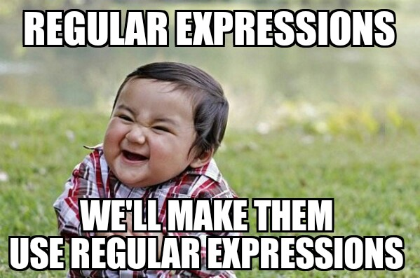

# [Bootcamp Web Developer Full Stack](https://www.thebridge.tech/bootcamps/bootcamp-fullstack-developer/)
### JS, ES6, Node.js, Frontend, Backend, Express, React, MERN, testing, DevOps

## Clase 26

### RegExp

### Teoría - RegExp
- [RegExp](https://developer.mozilla.org/es/docs/Web/JavaScript/Referencia/Objetos_globales/RegExp)
- [Teoría | javascript-regular-expressions](https://flaviocopes.com/javascript-regular-expressions/)
- [Ejemplos | regular-expressions](https://javascript.info/regular-expressions)
- [CodeWars | RegExp katas](https://www.codewars.com/collections/regex-katas)
- [regular-expressions](https://www.regular-expressions.info/email.html)
- [Use RegEx To Test Password Strength In JavaScript](https://www.thepolyglotdeveloper.com/2015/05/use-regex-to-test-password-strength-in-javascript/)

### Herramientas - RegExp
- [regexr](https://regexr.com/)
- [regex101](https://regex101.com/)
- [regular-expressions](https://www.regular-expressions.info/email.html)
- [emailregex](https://emailregex.com/)

### EJERCICIOS - RegExp

En los siguientes ejercicios se pide validar un formulario, que se enviará por post, en el que haya tres campos: email, contraseña y raza. En el caso de la raza, será un input de tipo datalist, en el que aparecerán las categorías humano, elfo, enano y hobbit.

### 1. Validación de Email
Necesitamos validar estos campos con expresiones regulares según estas condiciones:

Para el nombre del correo (ej. laura12):
- Que empiece por letra o número, y tenga al menos un carácter
Para el dominio (ej. `@hotmail @gmail`):
 - Que tenga @
 - Que tenga solo letras, y al menos tres caracteres
Para el dominio padre (ej. .es .com .org)
 - Podrá tener dos `(.es, .fr, .it,…)` o tres letras `(.com, .net, .org,..)` o cuatro `(.mobi, info,…)`
 - Debe ir al final, detrás de un punto
 - *La expresión regular sería algo como: expresionregular@expresionregular.expresionregular. Ej: elena@gmail.com; pepe03@hotmail.es
Crearemos un formulario que llamará a la función `checkEmail`. Esta función será la que ejecute la expresión regular. Se le pasará como argumento el valor del email recogido. 
- Patrón RegExp: expresionregular@expresionregular.expresionregular

### 2. Validación de Contraseña

- Que empiece por una letra o número
- Que tenga entre 6 y 20 caracteres
- Que se pueda poner alguno de estos símbolos, o varios: `!,@,#,$,%,&`
- Que haga una búsqueda global en toda la cadena
Para la implementación de validar la contraseña, vamos a crear la función `checkPassword`. Esta función será la que ejecute la expresión regular. Se le pasará como argumento el valor de la contraseña recogida

### 3. Extra: Checkear raza
- Que no tenga caracteres alfanuméricos(ya que son opciones que hemos puesto para elegir)
- Que se pueda elegir entre humano, elfo, hobbit o enano
- Que haga una búsqueda global en toda la cadena
Para la implementación de checkear si es una de las razas o no, en el datalist del formulario, lo relacionaremos con la función `checkRace`. Esta función será la que ejecute la expresión regular. Se le pasará como argumento el parámetro `raceOrNot`, que será el valor de la opción seleccionada del datalist

