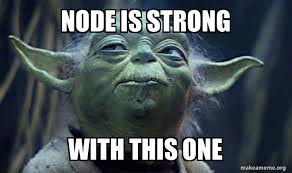
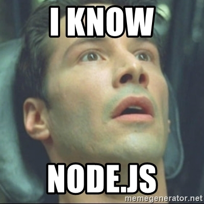

# [Bootcamp Web Developer Full Stack](https://www.thebridge.tech/bootcamps/bootcamp-fullstack-developer/)
### JS, ES6, Node.js, Frontend, Backend, Express, React, MERN, testing, DevOps

### Proyecto intermedio: Job App

### Requisitos del proyecto

Se pide desarrollar una aplicación web de búsqueda y gestión de `ofertas laborales en España / proyectos freelance en todo el mundo / cursos on-line sobre desarrollo web`. Trabajaremos sobre los conceptos vistos de Frontend y Backend en clase.

**Aclaración inicial previa**: La app tendrá dos roles distintos: `Usuario y Administrador`. Las funcionalidades que aparecerán tanto en el panel de control como en el resto de endpoints variarán dependiendo del tipo de usuario, no pudiendo nunca acceder a aquellas zonas o contenidos que no le corresponden.

### Endpoints

Endpoints web:

- [GET] `/` Vista de inicio de la app
- [GET] `/signup` Vista de registro de usuario
- [GET] `/login` Vista de ingreso de usuario ya registrado
- [GET] `/favorites` Vista del usuario con sus favoritos
- [GET] `/profile` Vista del usuario o el administrador con sus datos de perfil
- [GET] `/users` Vista del administrador con el listado de usuario registrados (admin)
- [GET] `/dashboard` Vista del administrador para crear y visualizar sus anuncios (admin)

Endpoints API: 

- [POST] `/api/user` Registrarse en la aplicación 
- [PUT] `/api/user` Editar datos del perfil del usuario o administrador
- [DELETE] `/api/user` Borrar un usuario de la base de datos (admin)
- [POST] `/api/login` Hacer login en la aplicación
- [POST] `/api/logout` Salir
- [GET] `/api/search` Listado de resultados de la búsqueda
- [POST] `/api/ads` Crear una oferta de trabajo o curso (admin)
- [PUT] `/api/ads` Editar datos de una oferta de trabajo o curso (admin)
- [DELETE] `/api/ads` Borrar una oferta de trabajo o curso de la base de datos (admin)
- [POST] `/api/favorites` Guardar favorito del usuario 
- [DELETE] `/api/favorites` Borrar favorito del usuario

### Menú

No asociado a ningún endpoint concreto, sino que estará presente una vez dentro de la app, pasada la identificación, en todas las vistas excepto el Panel de control.

Dicho menú se podrá representar como se desee, si bien se recomienda un efecto de persiana asociada a un icono de hamburguesa.

Endpoints para usuario no logueado:

- [GET] `/` Inicio
- [GET] `/register` Registrarse
- [GET] `/login` Ingresar

Endpoints para usuario logueado:

- [GET] `/` Inicio
- [GET] `/favorites` Vista de favoritos
- [GET] `/profile` Vista de los datos del perfil
- [POST] `/logout` Salir (redirige a `/`)

Endpoints para menú Administrador:

- [GET] `/` Inicio
- [GET] `/profile` Vista de los datos del administrador
- [POST] `/logout` Salir
- [GET] `/users` Vista de listado de usuarios dados de alta en el sistema
- [GET] `/dashboard` Vista para dar de alta nuevos anuncios

### Vista inicial (home) para usuario logueado y no logueado:

- [GET] `/`: Vista de inicio de la app. Tendrá como mínimo un input de texto y un botón para efectuar la búsqueda. Una vez realizada la misma, se mostrará debajo una lista de "tarjetas" que contengan los datos más relevantes de cada resultado.
Cada "tarjeta" contendrá un enlace a la fuente original de la información, que se abrirá en una pestaña nueva del navegador.   
Cada vez que se realice una nueva búsqueda, los resultados anteriores dejarán de mostrarse. 

#### **NOTA:** Sobre guardar en favoritos:
Si el usuario está logueado, visualizará en cada tarjeta un botón para guardar cada una de ellas en `favoritos`. Este botón almacenará en nuestra BD de SQL los datos de dicha tarjeta. 

### Vista inicial (home) de administrador

- [GET] `/`: Vista de inicio de la app. Tendrá dos botones: 

    - Botón usuarios: Te lleva a la vista de usuarios dados de alta
    - Botón anuncios: Te lleva a la vista de anuncios dados de alta

### Vista registro

- [GET] `/register` : Registro de usuario nuevo. Tendrá como mínimo un formulario con los campos: nombre, email y contraseña (los dos últimos serán usados como credenciales de acceso a la app). Además, deberá ofrecer la alternativa de identificación mediante Google, Facebook u otro proveedor de autenticación a elección.

Los usuarios se guardarán en la BD SQL.

### Vista ingresar

- [GET] `/login`: Validación de credenciales, abrir sesión y redirección a **home**.

---
---

_Opcional: Se podrá ofrecer la opción de recuperar contraseña. Esto implica construir dos vistas nuevas:_

- [GET] `/recuperarpassword`: _Tendrá un input para ingresar el e-mail y un botón. Al hacer click se enviará al e-mail (previa comprobación de que corresponde a un usuario existente en la BD) un link que redirija a "/restablecerpassword" y que además contendrá un JWT._

- [GET] `/restablecerpassword`: _Tendrá dos inputs, el primero será para ingresar la nueva contraseña y el segundo será para repetir la constraseña. Si coinciden, se guardará dicha actualización en la BD previa comprobación de la validez del JWT._ 

---
---

### Vista favoritos

- [GET] `/favorites` : Mostrará los resultados seleccionados por el usuario como favoritos, del mismo modo en que se muestran los resultados de búsqueda. Cada "tarjeta" tendrá un botón para borrar la selección de favoritos. Esta vista será privada y solo se podrá acceder si el usuario está logueado. 

Los favoritos del usuario se leerán de la BD de SQL. 

### Vista perfil

- [GET] `/profile` : Mostrará datos del usuario o administrador logueado. Estos datos podrán ser editados.

### Vista para dar de alta nuevos anuncios (dashboard) de administrador

- [GET] `/dashboard` :  Tendrá un formulario con los campos necesarios para crear un nuevo anuncio de empleo o curso. Además se mostrarán las tarjetas de los anuncios ya creados por el administrador. Los anuncios creados por el administrador podrán ser editados o borrados.

El nuevo anuncio creado será guardado en la BD MongoDB.

### Vista de usuarios

- [GET] `/users` : Mostrará la lista de usuarios registrados en la aplicación. Cada usuario podrá ser editado o borrado por el administrador. Además podrá dar de alta nuevos usuarios.

### Notas adicionales

### Sobre el control de acceso
La aplicación debe estar protegida a entradas indebidas de usuarios no registrados (o autorizados por un proveedor externo), de manera que el endpoint asociado a la zona privada (`/favorites`) comprobará si la sesión está abierta, y en caso contrario redireccionará al área `login` de la app.

El `login` con credenciales email y contraseña, deberá hacerse mediante JWT. El `login` con uno o más proveedores de terceros deberá hacerse mediante `OAuth` (con o sin Firebase, a elegir; en cualquier caso, con un proveedor OAuth será suficiente).

### Sobre el modelo de datos

El almacenamiento y la búsqueda de los datos, se realizará de la siguiente manera:

Toda la información relativa a los `usuarios` de la plataforma (credenciales y otras cuestiones de acceso, así como la asociación de favoritos a usuarios) se almacenará en una base de datos relacional SQL.

Los datos de las `búsquedas` pueden provenir de:
- **Scraping**. Al menos dos webs distintas que deberán seleccionarse previo análisis. 
- **BD MongoDB** . Es posible que el administrador haya dado de alta ofertas que coincidan con dicha búsqueda.

El modelo de datos dependerá de la información que pueda recogerse de las plataformas elegidas. 

Toda la información sobre los anuncios creados por el administrador se guardará en una BD NoSQL con MongoDB)

### Sobre la app

La aplicación debe ser `mobile-first` y de tipo `Server Side Rendering` utilizando un motor de plantillas (`Pug`).

## Control de versiones

Gestión del control de versiones con GitHub desde el principio del proyecto. Lo utilizaremos para trabajar en equipo de manera paralela, utilizando ramas, pull request, fork, etc.

### Sobre los recursos de terceros

Se permite (y recomienda, si con ello se minimiza el tiempo de desarrollo y se acelera así el de entrega) el `uso de cualquier recurso de terceros` (librerías, paquetes npm, etc.) además del código propio.

### Sobre la metodología

Durante el desarrollo del proyecto completo, se seguirá una metodología ágil tipo `SCRUM`, aplicando además `TDD` desde el comienzo hasta el final.

Esto implicará el establecimiento de un backlog de tareas, un sprint con sus story points y reparto de tareas, así como la creación de tests unitarios desde el principio y, a ser posible, la realización de tests e2e al final.

---
---

### Especificaciones para grupo de OFERTAS LABORALES

- Las ofertas de empleos en programación que ofrezca el buscador serán _sin experiencia previa_

### Especificaciones para grupo de <strong>PROYECTOS FREELANCE</strong>

- Las ofertas de proyectos freelance en programación deben ser pequeños proyectos.

### Especificaciones para grupo de <strong>CURSOS DE PROGRAMACIÓN</strong>

- El objetivo de esta búsqueda es que la app ofrezca todos los resultados de los cursos encontrados destacando visualmente el que la app defina como "recomendado". 

# A por ello!!

