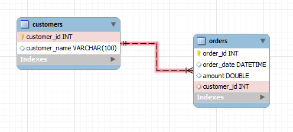

# [Bootcamp Web Developer Full Stack](https://www.thebridge.tech/bootcamps/bootcamp-fullstack-developer/)
### JS, ES6, Node.js, Frontend, Backend, Express, React, MERN, testing, DevOps

## Clase 29

### Intro a BBDD SQL


>SQL (por sus siglas en inglés Structured Query Language) es un lenguaje declarativo de acceso a bases de datos relacionales que permite especificar diversos tipos de operaciones en ellas. Una de sus características es el manejo del álgebra y el cálculo relacional que permiten efectuar consultas con el fin de recuperar, de forma sencilla, información de bases de datos, así como hacer cambios en ellas. [Wikipedia](https://es.wikipedia.org/wiki/SQL)


Recursos:
- [SQL | w3schools](https://www.w3schools.com/sql/default.asp)
- [SQL | tutorialspoint](https://www.tutorialspoint.com/sql/index.htm)
- [SQL | javatpoint](https://www.javatpoint.com/sql-tutorial)
- [Alias SQL con varias tablas](https://www.w3schools.com/sql/sql_alias.asp)
- [SQL auto increment para primary key](https://alejandrojs.wordpress.com/2017/09/20/primary-keys-y-auto-increment-en-sql/)

### SQL vs NoSQL
- [sql-vs-nosql-ventajas-y-desventajas](https://medium.com/@marlonmanzo/sql-vs-nosql-ventajas-y-desventajas-849ccc9db3d4)
- [mysql-vs-mongodb-cuando-y-donde-usar-cada-uno](https://impactotecno.wordpress.com/2018/02/26/mysql-vs-mongodb-cuando-y-donde-usar-cada-uno)


### SQL Básico




**Crear una base de datos**
```sql
  CREATE DATATABASE mibasedeatos;
```

**Crear una tabla**
```sql
  CREATE TABLE Persons
  (
  PersonID int,
  LastName varchar(255),
  FirstName varchar(255),
  Address varchar(255),
  City varchar(255)
  );
```
- [Ejemplo](http://www.w3schools.com/sql/trysql.asp?filename=trysql_create_table)

**SELECT - Realizar consultas**
- Traer todos los datos de una tabla
```sql
  SELECT * FROM nombretabla;
```
- Traer solo alguna columnas  de una tabla
```sql
  SELECT columna1, columna2 FROM nombretabla;
```

**WHERE - Condicciones de filtrado**
```sql
  SELECT * FROM personas 
  WHERE nombre = 'PEPE'
```

**AND OR - Condicciones lógicas**
```sql
  SELECT * FROM personas 
  WHERE nombre = 'PEPE' 
  AND apellido1 = 'PEREZ'
```

**ORDER BY** - Ordenación
```sql
  SELECT nombre, apellido1 
  FROM personas 
  ORDER BY apellido1 ASC;
```

**INSERT: Añadiendo datos en la tabla**
```sql
INSERT INTO nombre_tabla 
VALUES (valor1, valor2, valor3);
```

**UPDATE: Actualizar datos en la tabla**

```sql
UPDATE personas 
SET apellido2 = 'RODRIGUEZ' 
WHERE nombre = 'ANTONIO' 
AND apellido1 = 'GARCIA' 
AND apellido2 = 'BENITO';
```

**DELETE: Vaciar datos en la tabla**

- Todos los datos de una tabla
```sql
  DELETE * FROM nombre_tabla;
```

- Una fila específica
```sql
  DELETE FROM personas 
  WHERE nombre = 'LUIS' 
  AND apellido1 = 'LOPEZ' 
  AND apellido2 = 'PEREZ';
```

**ALTER: Eliminamos datos**
- Índice
```sql
  ALTER TABLE nombretabla 
  DROP INDEX nombreindice;
```

**DROP: Eliminar tablas/ base de datos**
- Tabla
```sql
  DROP TABLE nombretabla;
```

**Base de datos**
```sql
  DROP DATABASE nombrebasededatos;
```


**PRIMARY KEY**
- Clave primaria en una columna
```sql
  CREATE TABLE personas 
  { 
    identificador int NOT NULL, 
    nombre varchar(255) NOT NULL, 
    apellido1 varchar(255) NOT NULL, 
    PRIMARY KEY (identificador) 
  };
```
- Clave primaria usando multiples columnas
```sql
  CREATE TABLE personas 
  { 
    identificador int NOT NULL, 
    nombre varchar(255) NOT NULL, 
    apellido1 varchar(255) NOT NULL, 
    CONSTRAINT pers PRIMARY KEY (identificador, nombre) 
  };
```

**FOREIGN KEY**
- Relaciona la clave primaria de otra tabla
```sql
  CREATE TABLE departamentos 
  { 
  dep int NOT NULL PRIMARY KEY, 
  departamento varchar(255), 
  };
  
  CREATE TABLE personas 
  { 
  per int NOT NULL PRIMARY KEY, 
  nombre varchar(255), 
  apellido1 varchar(255), 
  dep int FOREIGN KEY REFERENCES departamentos (dep) 
  };
```

**Crear tabla con autoincremento**
```sql
CREATE TABLE personas 
{ 
  persona int NOT NULL AUTO_INCREMENT, 
  nombre varchar(255), 
  apellido1 varchar(255), 
  apellido2 varchar(255) 
};
```

### SQL: Seguridad - Inyección SQL
- [Inyección SQL](https://es.wikipedia.org/wiki/Inyecci%C3%B3n_SQL)
- [common-node-js-attack-vectors-sql-injection](https://medium.com/intrinsic/common-node-js-attack-vectors-sql-injection-b8b65ca78b68)
- [how-to-prevent-sql-injection-in-nodejs](
https://www.technicalkeeda.com/nodejs-tutorials/how-to-prevent-sql-injection-in-nodejs)

**Clasico ejemplo**
```javascript
//Código vulnerable
const consulta = `SELECT * FROM usuarios WHERE nombre = '${nombreUsuario}';`;

// Comporptamiento esperado...
nombreUsuario = "Yo Mismo"

// Hack...
nombreUsuario = "'; DROP TABLE usuarios; SELECT * FROM datos WHERE nombre LIKE '%"
```

### ¿Qué motor de BBDD SQL elegimos?
- [mysql-mariadb-postgresql](https://www.arsys.es/blog/mysql-mariadb-postgresql/)
- [open-source-databases](https://opensource.com/article/19/1/open-source-databases)


### MySQL


**Documentación**
- [Web Oficial](https://www.mysql.com/)
- [Why MySQL?](https://www.mysql.com/why-mysql/)
- [Case Studies](https://www.mysql.com/why-mysql/case-studies/)
- [MySQL Performance Tuning and Optimization Resources](https://www.mysql.com/why-mysql/performance/index.html)
- [Benchmarks](https://www.mysql.com/why-mysql/performance/index.html)
- [White Papers](https://www.mysql.com/why-mysql/white-papers/)
- [Documentación](https://dev.mysql.com/doc/)
- [MySQL 8.0 Reference Manual](https://dev.mysql.com/doc/refman/8.0/en/)
- [Github | Awesome MySQL](https://shlomi-noach.github.io/awesome-mysql/)

**Uso en Nodejs**
- [mysqljs/mysql](https://github.com/mysqljs/mysql)
- [mysql2](https://www.npmjs.com/package/mysql2)
- [sequelize](https://www.npmjs.com/package/sequelize)

```javascript
import mysql from 'mysql';
const connection = mysql.createConnection({
  host     : 'localhost',
  user     : 'me',
  password : 'secret',
  database : 'my_db'
});

connection.connect();

connection.query('SELECT 1 + 1 AS solution', (error, results, fields) => {
  if (error) throw error;
  console.log('The solution is: ', results[0].solution);
});

connection.end();
```

**Recursos**
- [w3School | Node.js MySQL](https://www.w3schools.com/nodejs/nodejs_mysql.asp)
- [Using MySQL with Node.js and the mysql JavaScript Client](https://www.sitepoint.com/using-node-mysql-javascript-client/)
- [MySQL Node.js](http://www.mysqltutorial.org/mysql-nodejs/)


### MariaDB


- [MariaDB](https://mariadb.org/)
- [Queries MariaDB](https://mariadb.com/kb/en/useful-mariadb-queries/)
- [MariaDB - Getting Started With the Node.js Connector](https://mariadb.com/kb/en/getting-started-with-the-nodejs-connector/)
- [A 10-minute MariaDB primer](https://mariadb.com/kb/en/mariadb/a-mariadb-primer/)


**Uso en Nodejs**

```javascript
const mariadb = require('mariadb');
const pool = mariadb.createPool({host: 'mydb.com', user:'myUser', connectionLimit: 5});

async function asyncFunction() {
  let conn;
  try {
	conn = await pool.getConnection();
	const rows = await conn.query("SELECT 1 as val");
	console.log(rows); //[ {val: 1}, meta: ... ]
	const res = await conn.query("INSERT INTO myTable value (?, ?)", [1, "mariadb"]);
	console.log(res); // { affectedRows: 1, insertId: 1, warningStatus: 0 }

  } catch (err) {
	throw err;
  } finally {
	if (conn) return conn.end();
  }
}
```

### PostgreSQL


**Documentación**
- [Web Oficial](https://www.postgresql.org/)
- [About](https://www.postgresql.org/about/)
- [node-postgres(PG)](https://node-postgres.com/)
- [PostgreSQL and NodeJS](https://mherman.org/blog/postgresql-and-nodejs/)
- [Connect to PostgreSQL database server using psql](https://www.postgresqltutorial.com/connect-to-postgresql-database/)

```javascript
const { Client } = require('pg')
const client = new Client()

await client.connect()

const res = await client.query('SELECT $1::text as message', ['Hello world!'])
console.log(res.rows[0].message) // Hello world!
await client.end()
```

### EJERCICIO: Instalación de entorno para trabajar con SQL

- Ubuntu
  - [Instalar PostgreSQL y pgADmin4](https://www.tecmint.com/install-postgresql-and-pgadmin-in-ubuntu/)
  - [Tutorial API REST con PostgreSQL](https://glaucia86.medium.com/developing-a-crud-node-js-application-with-postgresql-d25febb1cc4)

- Windows
  - [Instalar PostgreSQL y pgADmin4](https://www.postgresql.org/download/windows/)
  - [Instalar PostgreSQL y pgADmin4](https://www.postgresqltutorial.com/install-postgresql/)
  - [Instalar PostgreSQL y pgADmin4](https://www.guru99.com/download-install-postgresql.html)

- Mac
  - [Instalar PostgreSQL y pgADmin4](https://www.postgresql.org/download/macosx/)
  - [Instalar PostgreSQL y pgADmin4](https://www.postgresqltutorial.com/install-postgresql-macos/)
