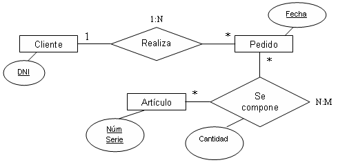
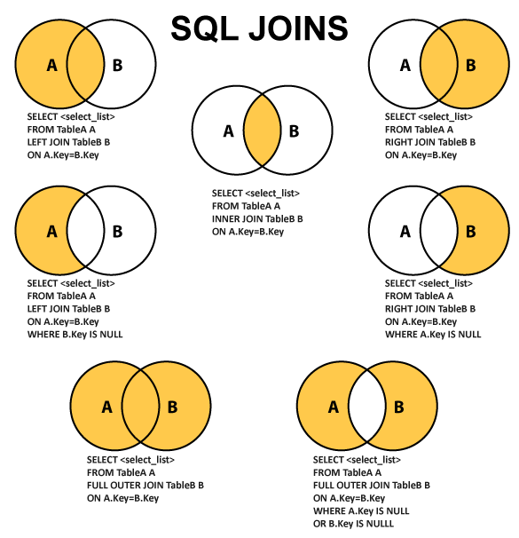

# [Bootcamp Web Developer Full Stack](https://www.thebridge.tech/bootcamps/bootcamp-fullstack-developer/)
### JS, ES6, Node.js, Frontend, Backend, Express, React, MERN, testing, DevOps

## Clase 29

### ERD (Diagrama entidad-relación)

- [entity-relationship-diagram](https://www.smartdraw.com/entity-relationship-diagram/)
- [e-r-model-in-dbms](https://beginnersbook.com/2015/04/e-r-model-in-dbms/)
- [er-diagram-tutorial-dbms](https://www.guru99.com/er-diagram-tutorial-dbms.html)
- [que-es-un-diagrama-entidad-relacion](https://www.lucidchart.com/pages/es/que-es-un-diagrama-entidad-relacion)
- [tutorial-del-diagrama-de-er](https://creately.com/blog/es/negocios/tutorial-del-diagrama-de-er/)
- [fundamento-de-las-bases-de-datos-modelo-entidad-relacion](https://www.genbeta.com/desarrollo/fundamento-de-las-bases-de-datos-modelo-entidad-relacion)



### Ejercicios ERD

Diseña el modelo entidad-relación para cada uno de los siguientes ejercicios.
- Ejercicio 1: crear el diagrama entidad-relación para una base de datos compuesta de libros , autores y lectores

- Ejercicios 2:
Tenemos que diseñar una base de datos sobre proveedores y disponemos de la siguiente información:
De cada proveedor conocemos su nombre, dirección, ciudad, provincia y un código de proveedor que será único para cada uno de ellos.
Nos interesa llevar un control de las piezas que nos suministra cada proveedor. Es importante conocer la cantidad de las diferentes piezas que nos suministra y en qué fecha lo hace. Tenga en cuenta que un mismo proveedor nos puede suministrar una pieza con el mismo código en diferentes fechas. El diseño de la base de datos debe permitir almacenar un histórico con todas las fechas y las cantidades que nos ha proporcionado un proveedor.
Una misma pieza puede ser suministrada por diferentes proveedores.
De cada pieza conocemos un código que será único, nombre, color, precio y categoría.
Pueden existir varias categorías y para cada categoría hay un nombre y un código de categoría único.
Una pieza sólo puede pertenecer a una categoría.


### SQL: Relaciones entre tablas


Recursos:
- [SQL | w3schools](https://www.w3schools.com/sql/default.asp)
- [SQL | tutorialspoint](https://www.tutorialspoint.com/sql/index.htm)
- [SQL | javatpoint](https://www.javatpoint.com/sql-tutorial)
- [Alias SQL con varias tablas](https://www.w3schools.com/sql/sql_alias.asp)
- [SQL auto increment para primary key](https://alejandrojs.wordpress.com/2017/09/20/primary-keys-y-auto-increment-en-sql/)

**FOREIGN KEY**
- Relaciona la clave primaria de otra tabla
```sql
  CREATE TABLE departamentos 
  { 
  dep int NOT NULL PRIMARY KEY, 
  departamento varchar(255), 
  };
  
  CREATE TABLE personas 
  { 
  per int NOT NULL PRIMARY KEY, 
  nombre varchar(255), 
  apellido1 varchar(255), 
  dep int FOREIGN KEY REFERENCES departamentos (dep) 
  };
```

**Si ya has creado la tabla y tienes que modificarla...**
```sql
Crear Foreign Key con Constraint:
ALTER TABLE News ADD WriterID INT;
ALTER TABLE News ADD CONSTRAINT FK_NewsWriters FOREIGN KEY (WriterID) REFERENCES Writers(ID);
```

**Insertar haciendo uso de la relación entre tablas**
- [how-do-i-insert-a-row-which-contains-a-foreign-key](https://dba.stackexchange.com/questions/46410/how-do-i-insert-a-row-which-contains-a-foreign-key)
- [insert-with-select-statement-for-columns-with-foreign-key-constraint-in-mysql](https://codeburst.io/insert-with-select-statement-for-columns-with-foreign-key-constraint-in-mysql-with-examples-f9ab57c8e4dd)

```sql
INSERT INTO News (Titulo, Contenido, URL, Topic, WriterID) VALUES( 'Noticia de andres', 'esta es la noticia de Andres', 'url_here', 'politica', (SELECT ID from Writers WHERE Email='andres@gmail.com') );
```
### SQL Avanzado: JOINS



Tipos:
- Interno
- Externo
- Cruzado

**INNER JOIN**
- Juntamos ambas tablas y sustituimos el codigo del departamento por su nombre
- Join por defecto
- Query
```sql
  SELECT Customers.CustomerName, Orders.OrderID
  FROM Customers
  INNER JOIN Orders
  ON Customers.CustomerID=Orders.CustomerID
  ORDER BY Customers.CustomerName;
```
- [Ejemplo](http://www.w3schools.com/sql/trysql.asp?filename=trysql_select_join_inner)


**LEFT JOIN**
- Devuelve todas las filas de la tabla de la izquierda, incluso si no coinciden con la tabla de la derecha
- Query
```sql
  SELECT Customers.CustomerName, Orders.OrderID
  FROM Customers
  LEFT JOIN Orders
  ON Customers.CustomerID=Orders.CustomerID
  ORDER BY Customers.CustomerName;
```
- [Ejemplo](http://www.w3schools.com/sql/trysql.asp?filename=trysql_select_join_left)


**RIGHT JOIN**
- Devuelve todas las filas de la tabla de la derecha, incluso si no coinciden con la tabla de la izquierda
- Query
```sql
  SELECT Orders.OrderID, Employees.FirstName
  FROM Orders
  RIGHT JOIN Employees
  ON Orders.EmployeeID=Employees.EmployeeID
  ORDER BY Orders.OrderID;
```
- [Ejemplo](http://www.w3schools.com/sql/trysql.asp?filename=trysql_select_join_right&ss=-1)


**FULL OUTER JOIN**
- Devuelve todas las filas de la tabla de la derecha y de la izquierda incluso si no coinciden
- Query
```sql
  SELECT Customers.CustomerName, Orders.OrderID
  FROM Customers
  FULL OUTER JOIN Orders
  ON Customers.CustomerID=Orders.CustomerID
  ORDER BY Customers.CustomerName;
```
- [Ejemplo](http://www.w3schools.com/sql/trysql.asp?filename=trysql_select_join_right&ss=-1)


### SQL Avanzado: Juntar tablas sin JOINS
**Con Joins**
```sql
SELECT R.departamento, SUM(P.precio) FROM registradoras R 
JOIN ventas V ON R.id = V.registradora_id 
JOIN productos P ON P.id = V.producto_id
GROUP BY R.departamento;
```

**Sin Joins**
```sql
SELECT R.departamento, SUM(P.precio) 
FROM registradoras R, ventas V, productos P
WHERE R.id = V.registradora_id AND P.id = V.producto_id
GROUP BY R.departamento; 
```


