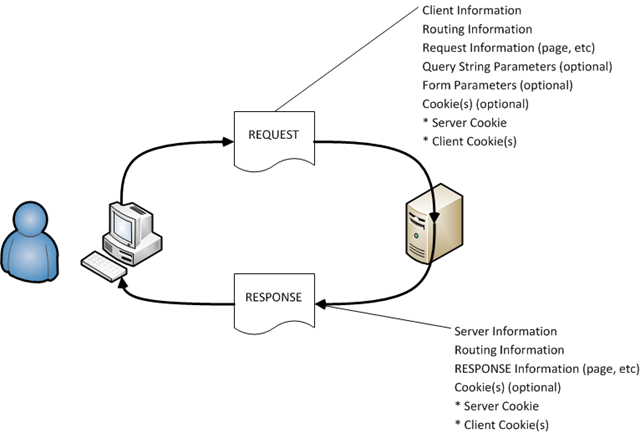
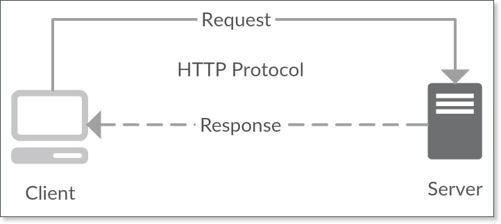
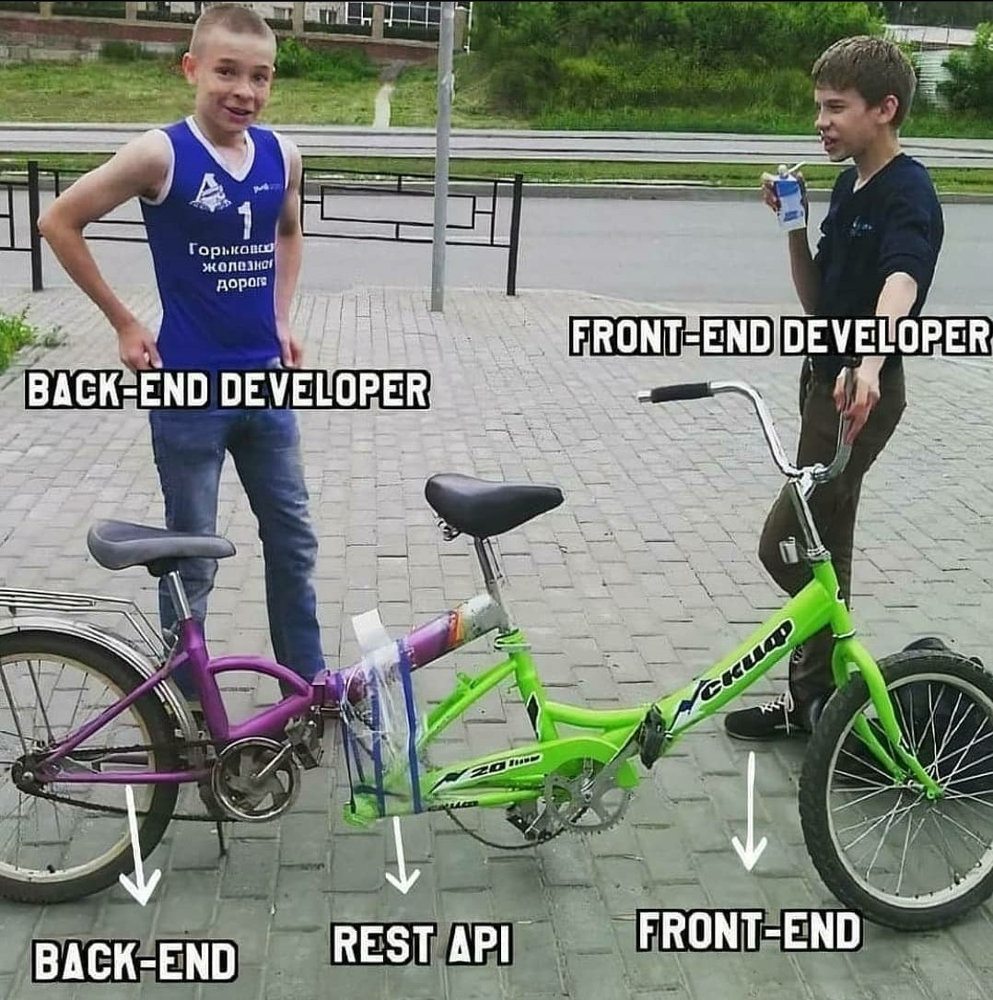

# [Bootcamp Web Developer Full Stack](https://www.thebridge.tech/bootcamps/bootcamp-fullstack-developer/)
### JS, ES6, Node.js, Frontend, Backend, Express, React, MERN, testing, DevOps

## Clase 32

### TALLER: Conexión cliente-servidor con una API REST
>>>>>>> ed3b7ecc7d74c58954368ec173b9bb636208b288

- Cliente: Aplicación de front ejecutándose en el puerto `5000`
- Servidor: API REST. Ejecutándose en el puerto `3000`
- Hacer un GET a la API desde la aplicación cliente y dibujar resultado de la consulta en el Front
- [Manejo de CORS](https://flaviocopes.com/express-cors/)

<<<<<<< HEAD
=======
