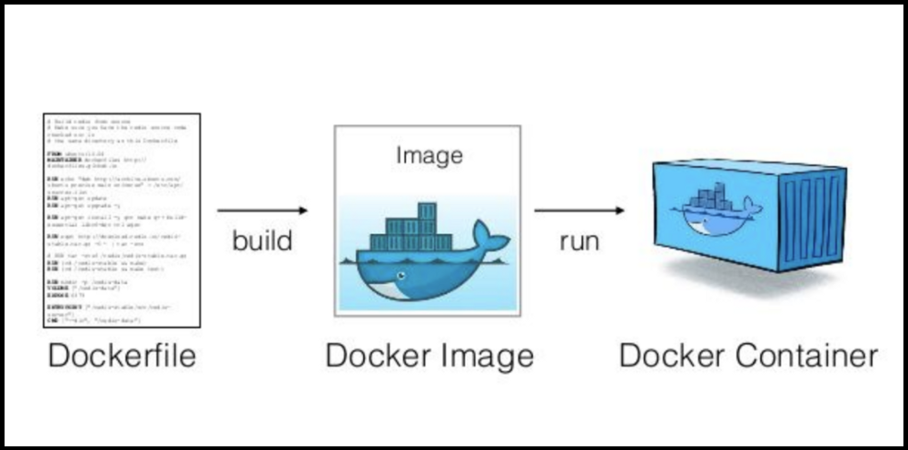
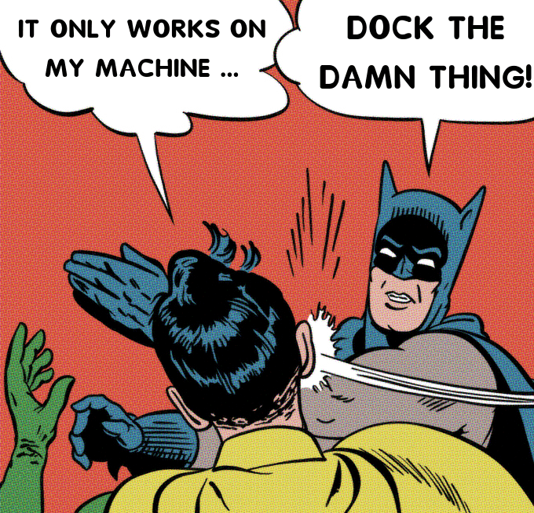
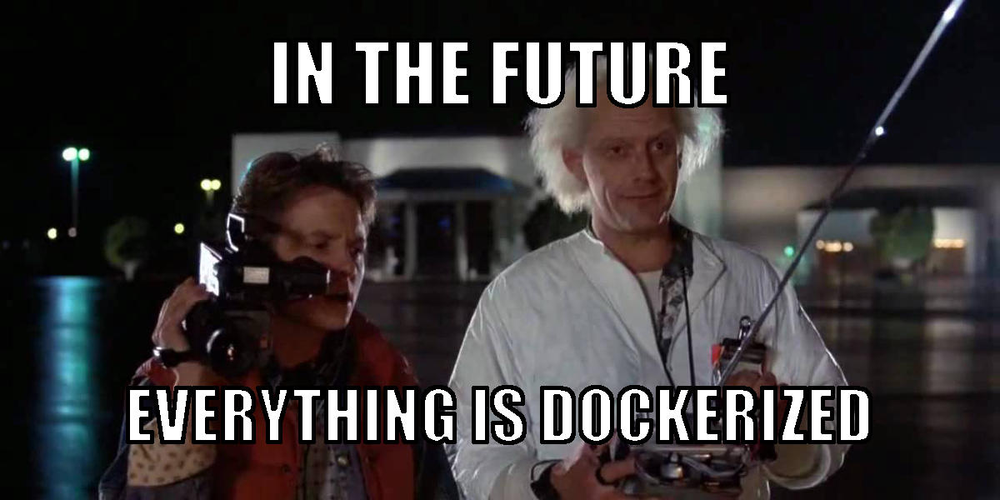

# [Bootcamp Web Developer Full Stack](https://www.thebridge.tech/bootcamps/bootcamp-fullstack-developer/)
### JS, ES6, Node.js, Frontend, Backend, Express, React, MERN, testing, DevOps

## Clase 47

### Docker

- [Docker](https://www.docker.com/)
- [Dockerhub](https://hub.docker.com/)
- [play-with-docker | Docker](https://www.docker.com/play-with-docker)
- [Docker | tutorialspoint](https://www.tutorialspoint.com/docker/index.htm)

# Docker - teoría

- [introduccion a docker para principiantes](https://guiadev.com/introduccion-a-docker/)
- [docker-vs-maquinas-virtuales](https://guiadev.com/docker-vs-maquinas-virtuales-mejor/)

### Crea tu propia imágen

- [Dockerizar imagen con Node](https://nodejs.org/en/docs/guides/nodejs-docker-webapp/)

### Dockerhub - publica tu imágen
- [Dockerhub](https://docs.docker.com/docker-hub/repos/)
- [publicar-tu-imagen-en-docker-hub](https://www.returngis.net/2019/02/publicar-tu-imagen-en-docker-hub/)
- [awesome docker containers](https://github.com/veggiemonk/awesome-docker)

### Docker cheatsheet
- [list-of-docker-commands-cheat-sheet](https://phoenixnap.com/kb/list-of-docker-commands-cheat-sheet)
- [cheatsheet](https://devhints.io/docker)

