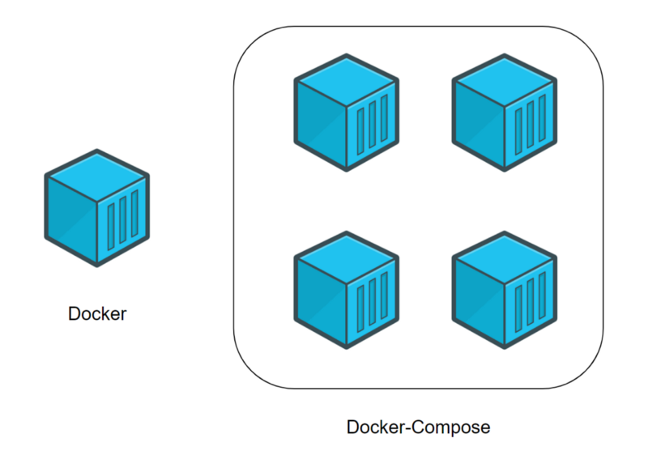
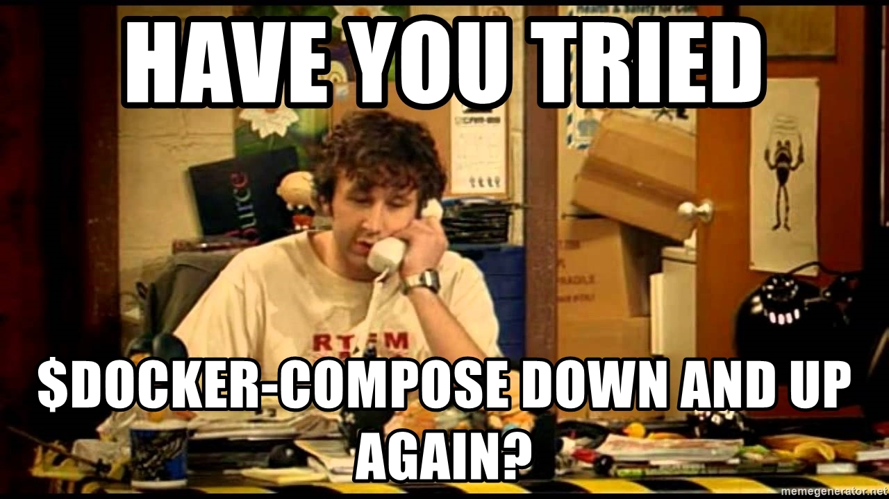

# [Bootcamp Web Developer Full Stack](https://www.thebridge.tech/bootcamps/bootcamp-fullstack-developer/)
### JS, ES6, Node.js, Frontend, Backend, Express, React, MERN, testing, DevOps

## Clase 48

### Docker: Docker compose

### Docker Compose - teoría
- [Breve introducción a Docker Compose para gente que no tiene ni idea de lo que está haciendo](https://josemmo.medium.com/breve-introducci%C3%B3n-a-docker-compose-para-gente-que-no-tiene-ni-idea-de-lo-que-est%C3%A1-haciendo-1da36d298aec)
- [despliegue-de-aplicaciones-con-docker-compose](https://colaboratorio.net/davidochobits/sysadmin/2018/despliegue-de-aplicaciones-con-docker-compose/)

### Microservicios 

>La arquitectura de microservicios es una aproximación para el desarrollo de software que consiste en construir una aplicación como un conjunto de pequeños servicios, los cuales se ejecutan en su propio proceso y se comunican con mecanismos ligeros.- [Wikipedia](https://es.wikipedia.org/wiki/Arquitectura_de_microservicios)

- [microservices](https://www.redhat.com/es/topics/microservices)
- [entendiendo qué son los contenedores y por qué es una de las mayores revoluciones de la industria del desarrollo](https://www.xataka.com/otros/docker-a-kubernetes-entendiendo-que-contenedores-que-mayores-revoluciones-industria-desarrollo)

### Cheatsheet
- [docker-compose](https://devhints.io/docker-compose)

### Docker sirve para crear contenedores de todo!
- [Docker compose | Getting Started](https://docs.docker.com/compose/gettingstarted/)

### Instalación
- [Docker compose | install](https://docs.docker.com/compose/install/)
- [Docker compose | install | Homebrew](https://formulae.brew.sh/formula/docker-compose)

### Ejercicio: Utiliza Docker compose con tu app React
- Despliega una app React con Docker Compose
- Investiga cómo funciona Nginx como servidor web
- Consigue que se pueda acceder a la app desde el puerto 80 usando Nginx para puesta en producción de tu app.

Recursos:
- [Docker-React-App](https://www.bogotobogo.com/DevOps/Docker/Docker-React-App.php)
- [Docker compose | build](https://docs.docker.com/compose/reference/build/)
- [como-configurar-nginx-con-node-js-en-produccion](
https://carlosazaustre.es/como-configurar-nginx-con-node-js-en-produccion)
- [¿Qué es nginx?](https://kinsta.com/es/base-de-conocimiento/que-es-nginx/)
- [An enterprise-style Node.js REST API setup with Docker Compose, Express and Postgres](https://codewithhugo.com/node-postgres-express-docker-compose/)
- [Docker Compose for Node.js and PostgreSQL](https://michalzalecki.com/docker-compose-for-nodejs-and-postgresql/)
- [Using Docker Compose for NodeJS Development](https://www.cloudbees.com/blog/using-docker-compose-for-nodejs-development)
- [Deploy applications on Amazon ECS using Docker Compose](https://aws.amazon.com/es/blogs/containers/deploy-applications-on-amazon-ecs-using-docker-compose/)

