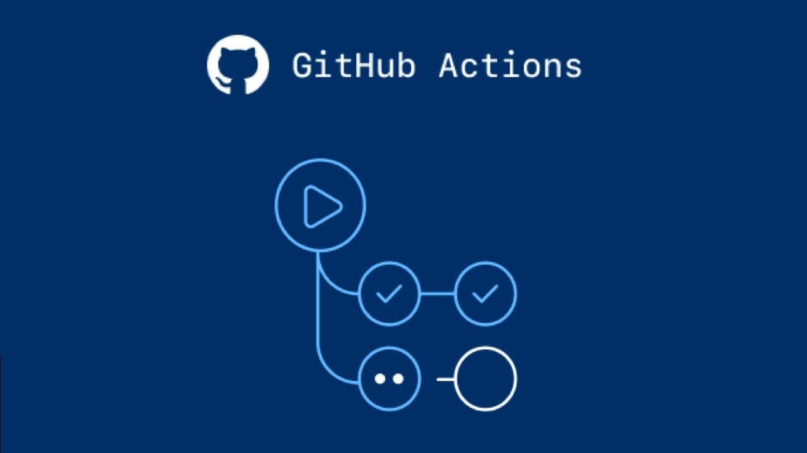
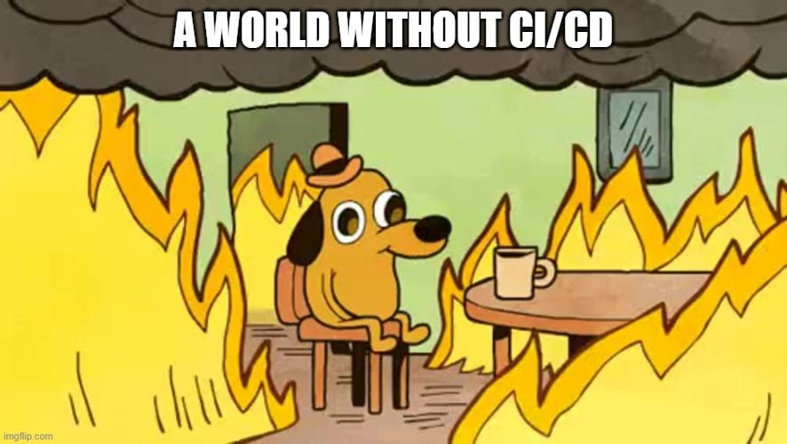

# [Bootcamp Web Developer Full Stack](https://www.thebridge.tech/bootcamps/bootcamp-fullstack-developer/)
### JS, ES6, Node.js, Frontend, Backend, Express, React, MERN, testing, DevOps


## Clase 50

### CI/CD


### CI/CD - Teoría

- [Que es CI/CD](https://www.redhat.com/es/topics/devops/what-is-ci-cd)
- [Pipeline CI/CD y otras opciones para automatización](https://www.itdo.com/blog/implementas-algun-pipeline-ci-cd-en-tu-organizacion/) 
- [Best 14 CI/CD Tools You Must Know](https://www.katalon.com/resources-center/blog/ci-cd-tools/)

### CI/CD: Jenkins


- [Jenkins](https://www.jenkins.io/)
- [Create a Jenkins CD Pipeline to build node.js and react application using npm](https://qascript.com/create-a-jenkins-cd-pipeline-to-build-node-js-and-react-application-using-npm/)
- [Jenkins - Tutorialspoint](https://www.tutorialspoint.com/jenkins/jenkins_overview.htm )
- [build-a-node-js-and-react-app-with-npm](https://www.jenkins.io/doc/tutorials/build-a-node-js-and-react-app-with-npm/)

Ejemplo Jenkinsfile:
```yml
#!/usr/bin/env groovy
pipeline {
  agent any
  tools {nodejs "latest"}
  stages {
    stage('preflight') {
      steps {
        echo sh(returnStdout: true, script: 'env')
        sh 'node -v'
      }
    }
    stage('build') {
      steps {
        sh 'npm --version'
        sh 'git log --reverse -1'
        sh 'npm install'
      }
    }
    stage('test') {
      steps {
        sh 'npm test'
      }
    }
  }
}
```
### CI/CD: Github Actions


- [ci-cd-with-github-actions](https://dev.to/michaelcurrin/intro-tutorial-to-ci-cd-with-github-actions-2ba8)


### A Meter CI/CD En nuestros proyectos!!



