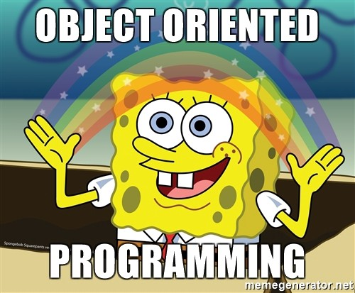
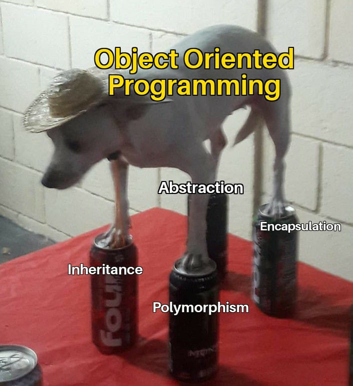

# [Bootcamp Web Developer Full Stack](https://www.thebridge.tech/bootcamps/bootcamp-fullstack-developer/)
### JS, ES6, Node.js, Frontend, Backend, Express, React, MERN, testing, DevOps

## Clase 1

### POO: La teoría


>La programación basada en prototipos es un estilo de programación orientada a objetos en la que las clases no están presentes y la reutilización de comportamiento (conocido como herencia en lenguajes basados en clases) se lleva a cabo a través de un proceso de decoración de objetos existentes que sirven de prototipos. Este modelo también se conoce como programación sin clases, orientada a prototipos o basada en ejemplos.
>[Mozilla developer network](https://developer.mozilla.org/es/docs/Learn/JavaScript/Objects/Object-oriented_JS)

<p>&#60;</p>

**Terminología**
- Clase
	- Define las características del Objeto.
- Objeto
	- Una instancia de una Clase.
- Propiedad
	- Una característica del Objeto, como el color.
- Método
	- Una capacidad del Objeto, como caminar.
- Constructor
	- Es un método llamado en el momento de la creación de instancias.
- Herencia
	- Una Clase puede heredar características de otra Clase.
- Encapsulamiento
	- Una Clase sólo define las características del Objeto, un Método sólo define cómo se ejecuta el Método.
- Abstracción
	- La conjunción de herencia compleja, métodos, propiedades que un objeto debe ser capaz de simular en un modelo de la realidad.
- Polimorfismo
	- Diferentes Clases podrían definir el mismo método o propiedad.

**Recursos**
- [MDN | JavaScript orientado a objetos para principiantes](https://developer.mozilla.org/es/docs/Learn/JavaScript/Objects/Object-oriented_JS)
- [The Little Guide for OOP in JS](https://hackernoon.com/the-little-guide-for-poo-in-js-3cfff83ad095)
- [Usando Clases en JavaScript](https://medium.com/@jmz12/usando-clases-en-javascript-e07f0e25c67d)
- [Introducción a la POO en Javascript moderno: las nuevas clases en ES6](http://www.etnassoft.com/2016/12/02/introduccion-a-la-poo-en-javascript-moderno-las-nuevas-clases-en-es6/)
 - [javascript-programación-orientado-a-objetos-fundamentos](https://mauriciogc.medium.com/javascript-programaci%C3%B3n-orientado-a-objetos-fundamentos-401746946459)
- [introducción-a-poo-con-javascript-es6](https://medium.com/academia-hack/introducci%C3%B3n-a-poo-con-javascript-es6-80074fde0cdf)
- [Goodbye, Object Oriented Programming](https://medium.com/@cscalfani/goodbye-object-oriented-programming-a59cda4c0e53)


### POO: Hasta ES5. Diseño de clases con prototipos

**Propiedades del Objeto + Constructor**
```javascript
let Coche = function (marca, modelo, antiguedad, color, tipo) {
    this.marca = marca;
    this.modelo = modelo;
    this.antiguedad = antiguedad
    this.color = color;
    this.tipo = tipo;
};
```

### POO: Métodos

**Asignación en el Constructor**
```javascript
let Coche = function (marca, modelo, antiguedad, color, tipo) {
    this.marca = marca;
    this.modelo = modelo;
    this.antiguedad = antiguedad;
    this.color = color;
    this.tipo = tipo;
    this.detalles = function(){
      console.log("Tu coche es un "+this.marca+" "+this.modelo+" con "+this.antiguedad+" años, clase "+this.tipo+" y color "+this.color);
    }
};

let miCoche = new Coche ("Peugeot", "607", 2002, "rojo", "turismo");
miCoche.detalles();
```


**Extensión del prototipo**
```javascript
let Coche = function (marca, modelo, antiguedad, color, tipo) {
    this.marca = marca;
    this.modelo = modelo;
    this.antiguedad = antiguedad;
    this.color = color;
    this.tipo = tipo;
};

Coche.prototype.detalles = function(){
  console.log("Tu coche es un "+this.marca+" "+this.modelo+" con "+this.antiguedad+" años, clase "+this.tipo+" y color "+this.color);
}

let miCoche = new Coche("Peugeot", "607", 2002, "rojo", "turismo");
miCoche.detalles();
```


**Vinculación Externa**
```javascript
let Coche = function (marca, modelo, antiguedad, color, tipo) {
    this.marca = marca;
    this.modelo = modelo;
    this.antiguedad = antiguedad;
    this.color = color;
    this.tipo = tipo;
    this.detalles = dameDetalles;
};

function dameDetalles(){
  console.log("Tu coche es un "+this.marca+" "+this.modelo+" con "+this.antiguedad+" años, clase "+this.tipo+" y color "+this.color);
}

let miCoche = new Coche("Peugeot", "607", 2002, "rojo", "turismo");
miCoche.detalles();
```

### POO: Herencia

**Herencia (simplificada)**
```javascript
let Perro  = function () {
    this.patas = 4;
    this.ojos = 2;
};

let PastorAleman = function () {
    this.colorLengua = "negra";
    this.colorOjos = "marrón";
    this.capacidadTrabajo = true;
    this.especialidad = "Pastoreo";
};

PastorAleman.prototype = new Perro();

let miPerro = new PastorAleman();
console.log("Número patas: "+miPerro.patas+"\n Número ojos: "+miPerro.ojos+"\n Color Lengua: "+miPerro.colorLengua+"\n Color ojos: "+miPerro.colorOjos+"\n Capacidad de trabajo: "+miPerro.capacidadTrabajo+"\n Especialidad: "+miPerro.especialidad);
```

**Herencia clásica**
```javascript
let Coche = function (marca, modelo, antiguedad, color, tipo) {
    this.marca = marca;
    this.modelo = modelo;
    this.antiguedad = antiguedad;
    this.color = color;
    this.tipo = tipo;
    this.detalles = dameDetalles;
};

let Furgon = function (taraMinima, cargaUtil, volumenCarga) {
    this.taraMinima = taraMinima;
    this.cargaUtil = cargaUtil;
    this.volumenCarga = volumenCarga;
    this.detallesTecnicos = detallesTecnicos;
};


function dameDetalles(){
  console.log("Tu coche es un "+this.marca+" "+this.modelo+" con "+this.antiguedad+" años, clase "+this.tipo+" y color "+this.color);
}

function detallesTecnicos(){
  console.warn("Tu coche tiene una Tara mínima de "+this.taraMinima+". Carga útil de "+this.cargaUtil+" y un volumen de carga de "+this.volumenCarga+"m3");
}

let miVehiculo = new Coche ("Land Rover", "Santana Aníbal", 35, "Marrón tierra", "4x4");
miVehiculo.prototype = new Furgon (1200, 768, 4.5);


miVehiculo.detalles();
miVehiculo.prototype.detallesTecnicos();
```


### POO: en la realidad

**Métodos y atributos privados y públicos**
```javascript
let CocheEmpresa = function (marca, modelo, antiguedad, color, tipo) {
    // públicas
    this.marca = marca;
    this.modelo = modelo;
    this.antiguedad = antiguedad;
    this.color = color;
    this.tipo = tipo;
    
    // privadas
    let ITVPasada = true;
    let ITVfrecuencia = "Cada año";
    let seguroEnRegla = true;
    let companySeguros = "Mapfre";
    let tipoSeguro = "a terceros";
	
	// Público
	this.dameDetalles = function () {
		console.log("Tu coche es un "+marca+" "+modelo+" con "+antiguedad+" años, clase "+tipo+" y color "+color);
    }
	
	// Privadas
    function datosPrivados() {
        if (ITVPasada && seguroEnRegla)
            console.info("INFO: Todo en Regla, tienes que pasar la ITV "+ITVfrecuencia+". Tienes un seguro "+tipoSeguro+" con "+companySeguros);
        else{
            console.error("ALERTA! El coche no puede usarse. El seguro o la ITV no esta en regla.");
        }
    }

    datosPrivados();
    this.dameDetalles();
};

let miCoche = new CocheEmpresa ("Audi", "S8", 2, "negro", "Berlina");
let miCoche2 = new CocheEmpresa ("Audi", "S4", 2, "Rojo", "Compacto");
```

**Datos opcionales**
```javascript
let CocheEmpresa = function (marca, modelo, antiguedad, color) {
    // En caso de no meter datos, se mete lo que está a la derecha del OR
    this.marca = marca || "Peugeot";
    this.modelo = modelo || "607";
    this.antiguedad = antiguedad || 2002;
    this.color = color || "Rojo";

	this.dameDetalles = function () {
		console.log("Tu coche es un "+this.marca+" "+this.modelo+" con "+this.antiguedad+" años y color "+this.color);
    }
	
    this.dameDetalles();
};

let miCoche = new CocheEmpresa ("Audi", "A4", 2008, "gris");
let miCoche2 = new CocheEmpresa();
let otroCoche = new CocheEmpresa("Seat", "Leon");
```

### POO: Trabajando con prototipos. Hacer copia de un objeto

**[Object.create()](https://developer.mozilla.org/es/docs/Web/JavaScript/Referencia/Objetos_globales/Object/create)**
```javascript
let Coche = {
    marca: "Peugeot",
    modelo: "607",
    antiguedad: 2002,
    color: "rojo",
    tipo: "turismo"
};

let clonCoche = Object.create(Coche);

console.log(clonCoche.marca+" "+clonCoche.modelo);
```


**[Object.prototype.isPrototypeOf()](https://developer.mozilla.org/es/docs/Web/JavaScript/Referencia/Objetos_globales/Object/isPrototypeOf)**
```javascript
console.log(Coche.isPrototypeOf(clonCoche));
```


**[Object.prototype.constructor](https://developer.mozilla.org/es/docs/Web/JavaScript/Referencia/Objetos_globales/Object/constructor)**
```javascript
function Persona (nombre) {
   this.nombre = nombre;
}

let miPersona = new Persona( "Pepe" );
console.log( "Persona.constructor es " + miPersona.constructor );
```


**[Object.prototype.toString()](https://developer.mozilla.org/es/docs/Web/JavaScript/Referencia/Objetos_globales/Object/toString)**
```javascript
function Coche (marca, modelo, antiguedad, color, tipo) {
    this.marca = marca;
    this.modelo = modelo;
    this.antiguedad = antiguedad;
    this.color = color;
    this.tipo = tipo;
};

let miCoche = new Coche("Peugeot", "607", 2002, "rojo", "turismo");

Coche.prototype.toString = function cocheToString() {
  let texto = "Marca: " + this.marca + ", modelo: " + this.modelo + ", antiguedad: " + this.antiguedad + ", color: " + this.color + ", tipo: " + this.tipo;
  return texto;
};

miCoche.toString();
```


### POO: con ES6+

**Definición de Clases**

```javascript
class Coche{
  constructor(marca, modelo, antiguedad, color, tipo) {
    this.marca = marca;
    this.modelo = modelo;
    this.antiguedad = antiguedad;
    this.color = color;
    this.tipo = tipo;
  }
  detalles() {
    console.log(`Tu coche es un ${this.marca} ${this.modelo} con ${this.antiguedad} años, clase ${this.tipo} y color ${this.color}`);
  }
}

let miCoche = new Coche("Peugeot", "607", 2002, "rojo", "turismo");
miCoche.detalles();
```

**Extensión de clases**

```javascript

class Coche{
  constructor(marca, modelo, antiguedad, color, tipo) {
    this.marca = marca;
    this.modelo = modelo;
    this.antiguedad = antiguedad;
    this.color = color;
    this.tipo = tipo;
  }
}

class Furgon extends Coche { 
  constructor (marca, modelo, antiguedad, color, tipo,taraMinima, cargaUtil, volumenCarga) {
    super(marca, modelo, antiguedad, color, tipo) // Llama al constructor del padre
    this.taraMinima = taraMinima;
    this.cargaUtil = cargaUtil;
    this.volumenCarga = volumenCarga;
    }
};

let miFurgon = new Furgon("Peugeot", "607", 2002, "rojo", "turismo",1200, 768, 4.5);
```

```javascript
class Perro {
  constructor(nombre) {
    this.patas = 4;
    this.ojos = 2;
    this.nombre = nombre;
  }

  ladrar() {
    console.log(`${this.nombre} esta ladrando!`);
  };
}

class PastorAleman extends Perro {
  constructor(nombre) {
    super('PastorAleman'); // Llama al constructor del padre y le pasa su parámetro
    this.colorLengua = "negra";
    this.colorOjos = "marrón";
    this.capacidadTrabajo = true;
    this.especialidad = "Pastoreo";
  }

  informacion() {
  	console.log(`Nombre: ${this.nombre}
  	Número patas: ${this.patas}
  	Número ojos: ${this.ojos}
  	Color ojos: ${this.colorOjos}
  	Color Lengua: ${this.colorLengua}
  	Capacidad de trabajo: ${this.capacidadTrabajo}
  	Especialidad: ${this.especialidad}`);
  }
}

let miPerro = new PastorAleman('Golden');
miPerro.informacion();
miPerro.ladrar();
```

**Métodos Estáticos**
No necesito tener creado un objeto para utilizar dichos métodos
```javascript
class Coche{
  static info(edad){
  	console.info(`Tienes ${edad} años ${ edad >= 18 ? "y puedes conducir": "y ... ¡Sorry! Sigue esperando para conducir."}`);
  }
  constructor(marca, modelo, antiguedad, color, tipo) {
    this.marca = marca;
    this.modelo = modelo;
    this.antiguedad = antiguedad;
    this.color = color;
    this.tipo = tipo;
  }
  detalles() {
    console.log(`Tu coche es un ${this.marca} ${this.modelo} con ${this.antiguedad} años, clase ${this.tipo} y color ${this.color}`);
  }
}

Coche.info(50);
Coche.info(8);
let miCoche = new Coche("Peugeot", "607", 2002, "rojo", "turismo");
```

**Getters/Setters**
```javascript

class Coche{
  constructor(marca, modelo, antiguedad, color, tipo) {
    this.marca = marca;
    this.modelo = modelo;
    this.antiguedad = antiguedad;
    this.color = color;
    this.tipo = tipo;
  }

    set setMarca  (marca)  { this.marca = marca }
    get getMarca  ()       { return this.marca }
    set setModelo (modelo) { this.modelo = modelo }
    get getModelo ()       { return this.modelo }
    set setAntiguedad (antiguedad) { this.antiguedad = antiguedad }
    get getAntiguedad ()       { return this.antiguedad }
    set setColor (color) { this.color = color }
    get getColor ()       { return this.color }
    set setTipo (tipo) { this.tipo = tipo }
    get getTipo ()       { return this.tipo }
    get detalles () {
    console.log(`Tu coche es un ${this.marca} ${this.modelo} con ${this.antiguedad} años, clase ${this.tipo} y color ${this.color}`);
  }
}

let miCoche = new Coche("Peugeot", "607", 2002, "rojo", "turismo");
miCoche.getColor
miCoche.setColor
miCoche.color
miCoche
```

**Manejo de propiedades privadas - optimizado desde ES2019**
- [MDN | Private class fields](https://developer.mozilla.org/es/docs/Web/JavaScript/Referencia/Classes/Private_class_fields)
- [javascript-private-class-fields](https://www.sitepoint.com/javascript-private-class-fields/)
```javascript
class Coche {
  // Declarar las variables privadas a usar
  #marca
  #modelo
  #antiguedad
  #color
  #tipo
  constructor(marca, modelo, antiguedad, color, tipo) {
    this.#marca = marca;
    this.#modelo = modelo;
    this.#antiguedad = antiguedad;
    this.#color = color;
    this.#tipo = tipo;
  }

    set setMarca  (marca)  { this.#marca = marca }
    get getMarca  ()       { return this.#marca }
    set setModelo (modelo) { this.#modelo = modelo }
    get getModelo ()       { return this.#modelo }
    set setAntiguedad (antiguedad) { this.#antiguedad = antiguedad }
    get getAntiguedad ()       { return this.#antiguedad}
    set setColor (color) { this.#color = color }
    get getColor ()       { return this.#color }
    set setTipo (tipo) { this.#tipo = tipo }
    get getTipo ()       { return this.#tipo }
    get detalles () {
    console.log(`Tu coche es un ${this.#marca} ${this.#modelo} con ${this.#antiguedad} años, clase ${this.#tipo} y color ${this.#color}`);
  }
}

let miCoche = new Coche("Peugeot", "607", 2002, "rojo", "turismo");
miCoche.getColor
miCoche.setColor
miCoche.color
miCoche

```


### POO: Las buenas partes



### POO: Las partes malas



### Ejercicio POO 1
- Crear la clase Persona, con propiedades nombre, edad y género, y el método obtDetalles(), que muestra por pantalla las propiedades de la persona.
- Crear la clase Estudiante, que hereda de Persona, e incluye las propiedades curso y grupo y el método registrar(), que muestre por pantalla el resultado.
- Crear la clase Profesor, que hereda de Persona, e incluye las propiedades asignatura y nivel y el método asignar(), que muestre por pantalla el resultado.
- Crear los objetos y casos de prueba necesarios para comprobar el correcto funcionamiento de la jerarquía de clases.

### Ejercicio POO 2 - kata Mayas y aztecas
- [kata mayas y aztecas](https://github.com/TheBridge-FullStackDeveloper/programacion-avanzada-kata-mayas-y-aztecas)

### Ejercicio POO 3 - Il sogno di volare
- [POO - Il sogno di volare](https://github.com/TheBridge-FullStackDeveloper/programacion-avanzada-pp-il-sogno-di-volare)
