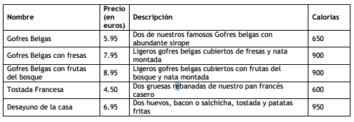

# [Bootcamp Web Developer Full Stack](https://www.thebridge.tech/bootcamps/bootcamp-fullstack-developer/)
### JS, ES6, Node.js, Frontend, Backend, Express, React, MERN, testing, DevOps

## Ejercicios Algoritmia

1. Escriba un programa que pida al usuario ingresar la longitud de la línea y muestre de uno en uno lo siguiente: 

        longitud: 5

        +++++

2. Escriba un programa que pida al usuario ingresar la longitud de la línea y dos caracteres;  y muestre de uno en uno lo siguiente:
 
        longitud: 5
        caracter1: -
        caracter2: +

        -+-+-

3. Escriba un programa que pida al usuario ingresar la altura y el ancho de un rectángulo y lo dibuje utilizando asteriscos:
        
        
        Altura: 3
        Ancho: 5

        *****
        *****
        *****

4. Escriba un programa que dibuje el triángulo del tamaño indicado por el usuario de acuerdo al ejemplo:

        Altura: 5

        *
        **
        ***
        ****
        *****

5. Escriba un programa que dibuje el hexágono del tamaño indicado por el usuario de acuerdo al ejemplo:

        Lado: 4

           ++++
          ++++++
         ++++++++
        ++++++++++
         ++++++++
          ++++++
           ++++

6. Escriba un programa que pida al usuario ingresar un usuario y una contraseña,  y le indique si ha validado o no, debemos tener mínimo 5 usuarios en el Local Storage (cargados previamente por el programa, con formato a elegir por el alumno) y usarlos para saber si el usuario ha accedido o no.

7. Ten precargado en un array 10 números e indica si uno pedido al usuario existe y en qué posición está.

8. Ten precargado en un array 20 números y ordénalo.

9. Crea un JSON que contenga la siguiente información de la manera que te parezca óptima:

Debes escribirlo en un fichero de texto con extensión ".json", no es necesario un programa asociado.

10. Disponemos en la caja del siguiente dinero distribuido de la siguiente manera: 234,27 € (información que se debe cargar en el Local Storage)
- Billetes de 500€: 0
- Billetes de 200€: 0
- Billetes de 100€: 0
- Billetes de 50€: 1 
- Billetes de 20€: 4
- Billetes de 10€: 8
- Billetes de 5€: 2
- Monedas de 2€: 5
- Monedas de 1€: 4
- Monedas de 0.50€: 0
- Monedas de 0.20€: 0
- Monedas de 0.10€: 1
- Monedas de 0.05€: 2
- Monedas de 0.02€: 3
- Monedas de 0.01€: 1

El programa obtiene un precio de artículo y un importe pagado desglosado (se deben conocer las cantidades entregadas de todos los billetes y monedas) y responderá si no hay cambio, si está justo o si se devuelve cambio, de nuevo con el desglose que debe ser lo más óptimo (es decir, si puedo devolver un billete de 20, no devuelvo 2 de 10, por ejemplo)

11. Modifica el programa anterior para que lo pagado pase a la caja y se realicen tres pagos consecutivos, con su devolución correspondiente.

12. Llevamos la agenda de un dentista, que tiene tratamientos de media hora y una hora. Los horario de trabajo son de 10 a 14 y de 16 a 20, se debe permitir al usuario pedir cita dentro de una semana sin festivos, de lunes a viernes y con un solo dentista. Se debe usar Firebase para almacenar la información de las citas reservadas y una vez asignada una cita, se debe actualizar la información. 