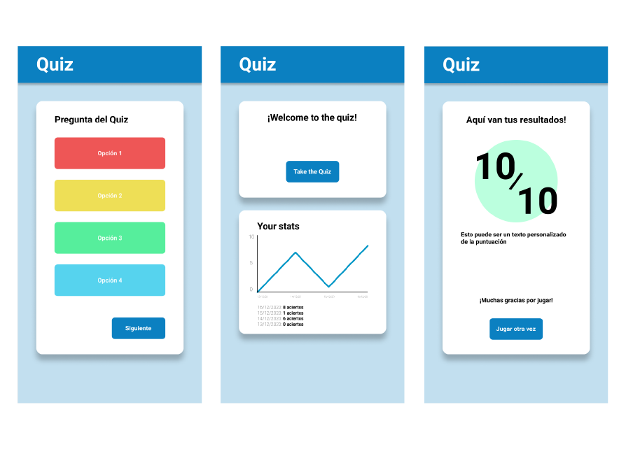
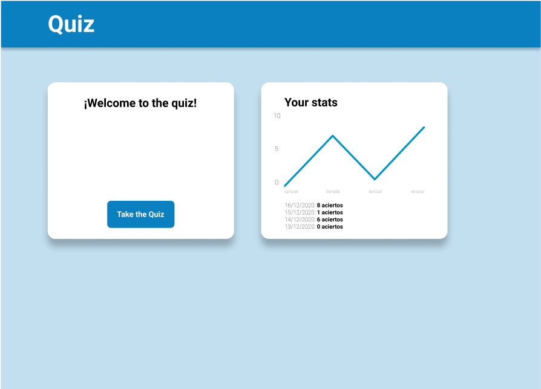
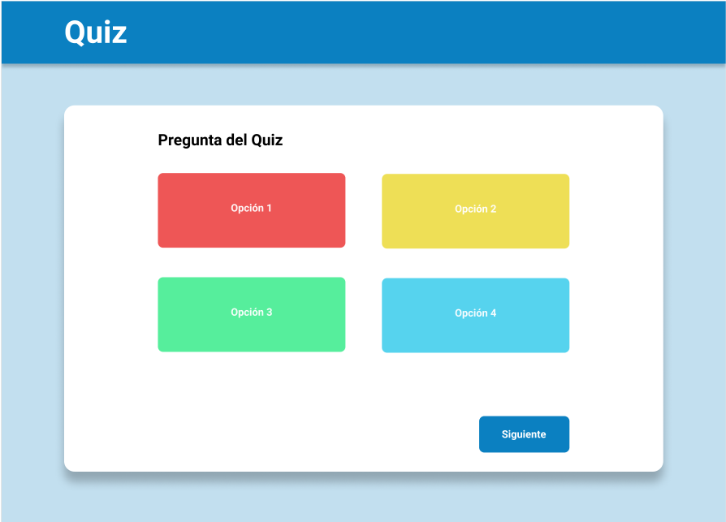
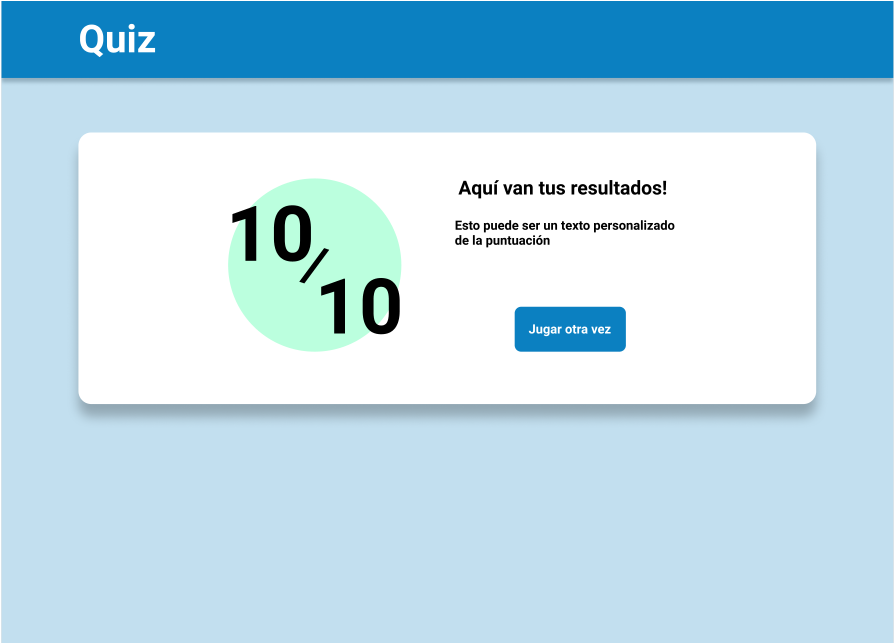
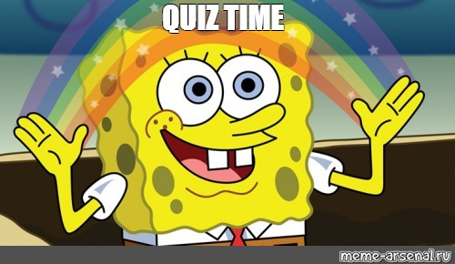

# [Bootcamp Web Developer Full Stack](https://www.thebridge.tech/bootcamps/bootcamp-fullstack-developer/)

### JS, ES6, Node.js, Frontend, Backend, Express, React, MERN, testing, DevOps

 

## EJERCICIO: Quiz de Halloween 🎃

 

Partiendo del Quiz que hemos ido haciendo estos días, volveremos a realizar refactorización para añadir nuevas funcionalidades.

 

**Objetivo**
- El Quiz constará de 10 preguntas. Cada pregunta tendrá 4 opciones y sólo una de ellas será la correcta.
- Podrán ser preguntas nuestras y preguntas que vengan de https://opentdb.com/
- La aplicación tendrá que ser una **SPA** *(single-page application)*. Sólo una pregunta cada vez en pantalla.

 

**Requisitos para este proyecto**
- Manipulación dinámica del **DOM**
- Crear una página **SPA** para las preguntas
- Manejo de **ES6**
- **Asincronía**. Usar API de preguntas https://opentdb.com/
- APIs HTML5: Uso de **Local storage y gráficas**, etc...
- Sin frameworks ni librerias externas en la medida de lo posible
- Gestión del proyecto desde el inicio en un único repositorio compartido (como colaboradores) en **Github**
- Código limpio, **buenas prácticas**

 

**Opcional**
- Otras APIs, mix de preguntas de distinas fuentes...
- En general, cualquier extra será bien recibido para que investiguéis por vuestra cuenta, siempre y cuando tenga sentido

 

---
---

## FASES
---

### FASE 1: Diseño del front
- Diseño responsive, mobile first, semántica HTML5

 

### FASE 2: Lógica de JavaScript
- Adaptar nuestra app acorde a lo que vimos en clase
- [proyectos-quiz-resurrected](https://github.com/TheBridge-FullStackDeveloper/proyectos-quiz-resurrected)

- Conseguir con 10 preguntas nuestras, guardadas en un array de objetos, se pueda jugar a nuestro Quiz. `[{..},{..},{..}...{..}]`

 

### FASE 3: Asincronía
- Javascript: Manejo de asincronía. Leer 10 preguntas random de la API de prenguntas para generar el Quiz

 

### FASE 4 (avanzado) - APIs HTML5
- Almacenar la puntuación de cada partida en un array de objetos `[{..},{..},{..}...{..}]` en Local Storage. Guardar puntuación y fecha en cada objeto del array

- Mostrar en la Home con una gráfica los resultados de las últimas partidas jugadas (leer puntuaciones de LocalStorage). Representar Fecha(eje X) vs Puntuación(eje Y)

 

### Páginas

- `home.html`. Página de bienvenida + gráfica de últimos resultados
- `question.html` SPA. Página para renderizar las 10 distintas preguntas 
- `results.html` Página para mostrar resultado del quiz

 

### Vista móvil

### Vista pc/tablet

### A por ello!!!

