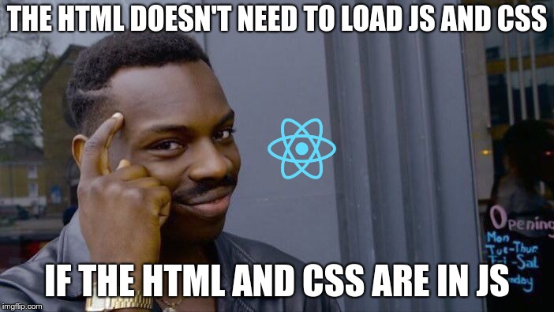
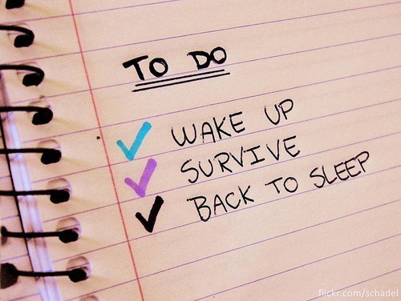

# [Bootcamp Web Developer Full Stack](https://www.thebridge.tech/bootcamps/bootcamp-fullstack-developer/)
### JS, ES6, Node.js, Frontend, Backend, Express, React, MERN, testing, DevOps

## Clase 43
**Estilos, librerías y preprocesadores**

 

### CSS en React

- [REACT | Estilo y CSS](https://es.reactjs.org/docs/faq-styling.html)


### **B**lock, **E**lement, **M**odifier - BEM

>El objetivo final de BEM es dividir la interfaz de usuario en bloques independientes para crear componentes escalables y reutilizables. Propone un estilo descriptivo para nombrar cada una de las clases a utilizar, permitiendo así crear un estructura de código consistente.

    
```html
    <button class="button">
	Normal button
    </button>
    <button class="button button--state-success">
	Success button
    </button>
    <button class="button button--state-danger">
	    Danger button
    </button>
```

```css
    .button {
	    display: inline-block;
	    border-radius: 3px;
	    padding: 7px 12px;
	    border: 1px solid #D5D5D5;
	    background-image: linear-gradient(#EEE, #DDD);
	    font: 700 13px/18px Helvetica, arial;
    }
    button--state-success {
	    color: #FFF;
	    background: #569E3D linear-gradient(#79D858, #569E3D) repeat-x;
	    border-color: #4A993E;
    }
    .button--state-danger {
	    color: #900;
    }
```

- [¿Qué es BEM?](https://blog.ida.cl/desarrollo/metodologia-bem-desarrollo-front-end/)

- [Documentación](http://getbem.com/introduction/)


### ¿Qué es un preprocesador?

- [MDN|que-es-un-preprocesador](https://developer.mozilla.org/es/docs/Glossary/Preprocesador_CSS)

> Un preprocesador CSS es un programa que te permite generar CSS a partir de la syntax única del preprocesador. Existen varios preprocesadores CSS de los cuales escoger, sin embargo la mayoría de preprocesadores CSS añadiran algunas características que no existen en CSS puro, como variable, mixins, selectores anidados, entre otros. Estas características hacen la estructura de CSS más legible y fácil de mantener.


### Ejemplo de preprocesador: SASS

- [SASS | Preprocesador de CSS](https://sass-lang.com/)

Innovaciones frente a CSS: 
- Variables
- Anidamiento 
- Parcials-Módulos
- Herencia

 

#

## Recursos y links de interés

### Bootstrap

> Framework para front con una multitud de liberías y workflows completos para realizar productos webs haciendo un gran énfasis en el diseño responsive

- [Bootstrap | Framework de Front](https://getbootstrap.com/)

### Material Design

> Librería que reune los esfuerzos de diseño de Google para productos digitales, reune iconos, componentes para React, y la filosofía con la que se diseña

- [Material Design | Material.io](https://material.io)

### Material Design UI: Una herramienta que nos facilita la vida. 

- [Material UI | Paquete de diseño](https://material-ui.com/)

### Material You

> Google anunció su primera actualización importante de Material Design, se llama Material You. Material You se expande sobre la base creciente del diseño de materiales para abarcar el creciente número de dispositivos de computación visual. 
- [Material You | La nueva versión de Material Design](https://material.io/blog/announcing-material-you)
#

### NextUI
- [Material You | La nueva versión de Material Design](https://nextui.org/docs/guide/getting-started)


### EJERCICIO: TODO LIST 

 

Crea una TODO list que contenga lo siguiente:

- Un formulario con input + botón
- Un componente List que recorra listas de items
- Un componente Item o Card que contenga cada TO DO
- Dar estilo CSS a los componentes con lo visto en clase para practicar

Flujo de la aplicación:

- Nada más empezar tendremos un input y un botón. El botón tendrá el texto ADD 
- Si hemos escrito algo en el input y hacemos click sobre el botón ADD, se añadirá un item debajo del input.
- Cuando un item sea añadido se borrará inmediatamente lo que habíamos escrito en el input.

TIP: usad el paquete de NPM UUID para manejar las keys de los diferentes elementos de la lista.
- [UUID](https://www.npmjs.com/package/uuid)
- [Sobre formularios](https://es.reactjs.org/docs/forms.html) 