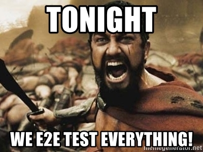
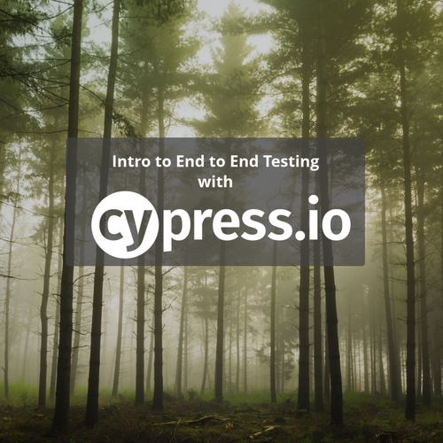

# [Bootcamp Web Developer Full Stack](https://www.thebridge.tech/bootcamps/bootcamp-fullstack-developer/)
### JS, ES6, Node.js, Frontend, Backend, Express, React, MERN, testing, DevOps

## Clase 46

### Testing E2E con Cypress + React

Los tests de aceptación o tests end-to-end son un tipo especial de tests de integración y tests funcionales que comprueban el resultado último de la aplicación y que se basan en los criterios definidos por el cliente. Por ejemplo, “que un usuario pueda crear una tarea nueva en nuestra aplicación de gestión de tareas”.

### React + Cypress
- [cypress-testing-library](https://testing-library.com/docs/cypress-testing-library/intro/)
- [react-testing-made-easy-with-cypress](https://abhinaba-ghosh.medium.com/react-testing-made-easy-with-cypress-262340597b08)
- [React + cypress tutorial](https://docs.cypress.io/examples/examples/tutorials#Best-Practices)

### Demo E2E con Cypress + React
- [using-cypress-to-write-tests-for-a-react-application](https://css-tricks.com/using-cypress-to-write-tests-for-a-react-application/)
- [Sacar screenshots con Cypress](https://www.toolsqa.com/cypress/screenshots-in-cypress/)
